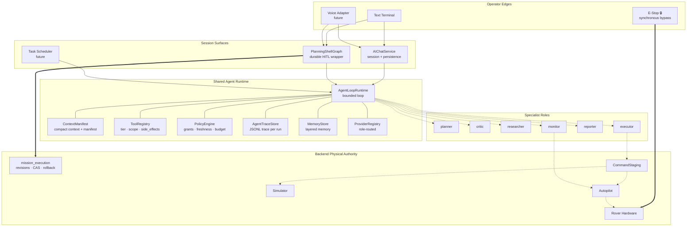
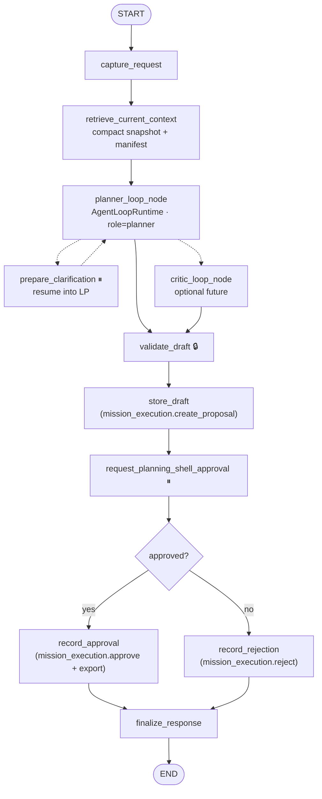
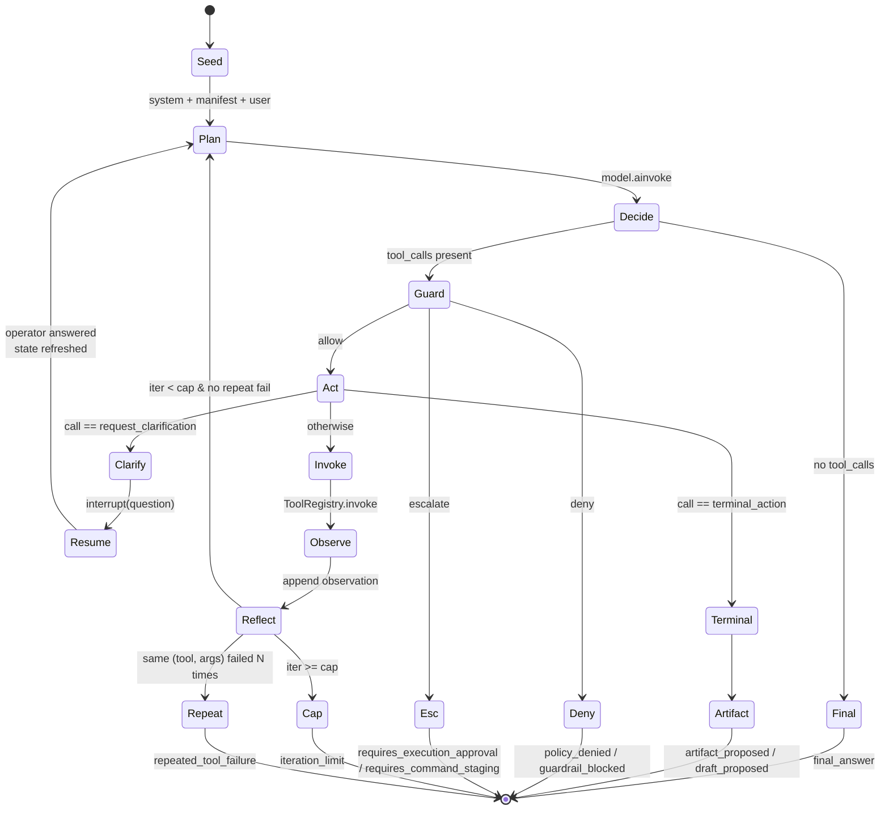
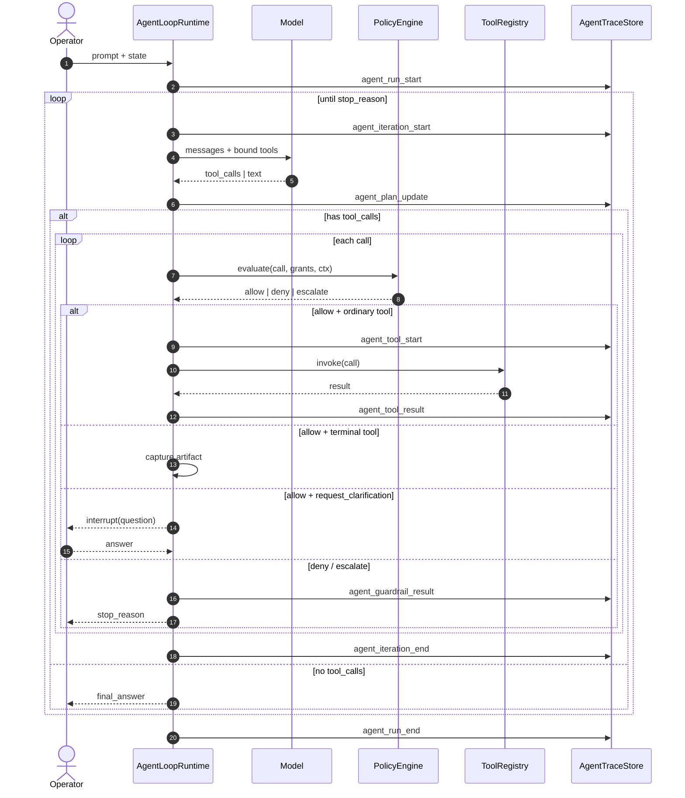
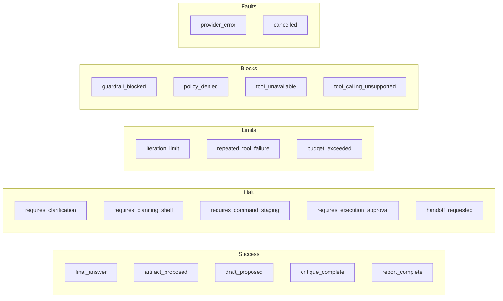
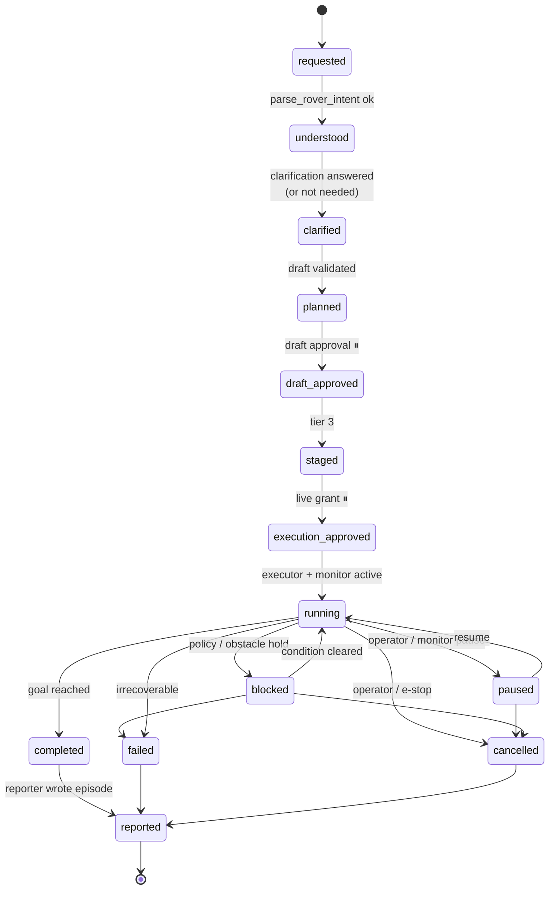
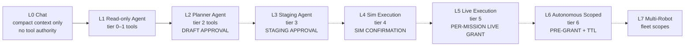

# AI Agent — Design

Status date: 2026-05-20.

**How** the AI agent is built — interfaces, file layout, runtime boundaries, the mission-execution lifecycle, route planning, mission export, the vehicle-profile abstraction, the phase plan, and rollback. Implementation-flexible companion to [requirements.md](./requirements.md). The requirements doc wins on product intent and fixed decisions; this doc wins on implementation specifics; [design.md](./design.md) wins on diagrams only.

Status note (implementation reality):

- `AgentLoopRuntime` is implemented and powers Agent chat.
- The visible `/ai` product surface is still Chat plus read-only Agent, with the planning shell entered explicitly through `/plan`.
- The planning shell wraps the planning flow.
- The planner-loop is the planning core; the superseded deterministic-DAG middle has been removed (Phase 6 done).
- `mission_execution` exists as an in-process subsystem with canonical revision storage, overlay/state APIs, durable controller mission snapshot state, compare-and-swap version checks, mutation/execute APIs, and a local execution-transition adapter.
- Canonical mission storage and approval/execution writes now flow through `mission_execution`, but planning-shell draft compatibility seams still exist around the current wrapper flow and real external controller transport remains the next slice.

This document is **expected to evolve** as implementation lands. File names, phase ordering, and runtime interface shapes can be updated in place through normal review.

## Table of Contents

- [Scope and Audience](#scope-and-audience)
- [Architecture Overview](#architecture-overview)
- [Mission Execution Boundary](#mission-execution-boundary)
- [AgentLoopRuntime](#agentloopruntime)
- [Tool and Permission Model](#tool-and-permission-model)
- [Policy Engine](#policy-engine)
- [Context and Data Strategy](#context-and-data-strategy)
- [Planning-Shell Integration](#planning-shell-integration)
- [Route Planning, Vehicle Profiles, and Mission Export](#route-planning-vehicle-profiles-and-mission-export)
- [Memory Subsystem](#memory-subsystem)
- [Specialist Agents and Handoffs](#specialist-agents-and-handoffs)
- [Reflection and Critique Loop](#reflection-and-critique-loop)
- [Task Subsystem](#task-subsystem)
- [Mission Supervision Subsystem](#mission-supervision-subsystem)
- [World Model and Observations](#world-model-and-observations)
- [Voice Subsystem](#voice-subsystem)
- [Provider Abstraction and Onboard Fallback](#provider-abstraction-and-onboard-fallback)
- [Budgeting and Governance](#budgeting-and-governance)
- [Safety Layers Beyond Code Invariants](#safety-layers-beyond-code-invariants)
- [Event Model](#event-model)
- [Observability, Replay, and Evaluation](#observability-replay-and-evaluation)
- [Migration Plan](#migration-plan)
- [Per-Phase Rollback](#per-phase-rollback)
- [Pre-Execution Readiness Checklist](#pre-execution-readiness-checklist)
- [Component Catalog](#component-catalog)
- [File Impact Map](#file-impact-map)
- [Provider Compatibility](#provider-compatibility)
- [Open Engineering Questions](#open-engineering-questions)

## Scope and Audience

This is the engineering reference for implementing the AI agent. Readers:

- engineers writing code in `gcs_server/ai/`
- reviewers approving phase rollouts
- on-call engineers debugging traces

Non-readers (for them, see [requirements.md](./requirements.md)):

- operators
- product reviewers debating fixed decisions

## Architecture Overview

```text
Operator Terminal (text today, voice later)
  │
  ▼
AIChatService / PlanningShell
  │
  ▼
AgentLoopRuntime  ────►  ContextManifest
  │                       compact context + manifest
  │
  ├──► ToolRegistry        permissioned tools, tier + scopes + side effects;
  │                       filtered by active VehicleProfile.planner_kind
  ├──► PolicyEngine        grants, freshness, side effects, budget, lifecycle gates
  ├──► MemoryStore         working / session / episodic / semantic /
  │                       procedural / world / operator (layered)
  ├──► AgentTraceStore     JSONL traces per run
  ├──► ProviderRegistry    role-based model routing
  └──► Specialists         planner, critic, researcher, monitor, reporter, executor
  │
  ▼
LangGraph workflow shell (durable HITL only)
  │
  ▼
mission_execution  ────►  canonical revisions, mission operation state machine,
                          policy, controller snapshot store, controller adapter,
                          verification, rollback, rebasing
  │
  ▼
Flight controller / autopilot (own physical authority; e-stop primacy)
```

Three boundaries are load-bearing:

- **The agent loop owns reasoning.** Picking tools, asking for clarification, drafting mission proposals, summarizing.
- **`ToolRegistry` + `PolicyEngine` own capability enforcement.** Permissions and grants are checked in code, not in prompts.
- **`mission_execution` and backend services own physical authority.** Canonical mission state, approval effects, controller lock, mission handoff, verification, rollback, low-level motion, autopilot handoff, and emergency stop do not belong to the model loop.

## Mission Execution Boundary

`mission_execution` is the deep backend module that owns mission-affecting state and controller-facing behavior. Reference: [ADR 0009](../../cross-cutting/decisions/0009-mission-execution-fold-under-ai-agent.md) for why it lives under `ai-agent/` rather than as a peer component.

### Responsibilities

Belongs to `mission_execution`:

- receive semantic mission proposal packages from the graph/runtime
- canonicalize mission revisions and assign deterministic IDs/lineage
- persist revisions immediately, before map render or approval UI
- emit authoritative mission lifecycle events
- evaluate mission policy and approval requirements
- own the mission operation state machine for mission-affecting requests
- manage controller mission versioning and compare-and-swap checks
- coordinate controller upload, read-back verification, rollback, and stale-state rebasing

Does **not** belong:

- general reasoning loop behavior
- ordinary AI chat response generation
- non-mission tool orchestration

### Deep modules to build or strengthen

- mission proposal intake and canonicalization
- mission revision store and lineage manager
- mission policy and approval evaluator
- mission operation lifecycle manager
- controller mission snapshot store
- controller adapter and verification layer
- rollback and rebase coordinator
- UI policy/session mode projection layer

### Deterministic ownership

The LLM is not trusted for anything that can be computed or derived analytically. Backend code owns:

- canonical mission IDs
- step and waypoint IDs (stable across reordering and geometry changes)
- lineage metadata (`parent_draft_id` or equivalent)
- validation rules
- policy evaluation
- operation state transitions
- controller version checks
- controller reconciliation
- cutover success/failure decisions

The graph/runtime hands off **semantic mission proposal packages** containing semantic mission content, route geometry or route artifacts, operator review context, and revision lineage metadata. It does **not** create authoritative mission lifecycle records directly.

### Mission operation lifecycle

Every operator mission request opens a first-class operation. The state machine represents planning, review, cutover, verification, rollback, rebasing, failure, and cancellation explicitly rather than through scattered flags.

- Each operation has a stable top-level `operation_id` linking graph progress, mission revisions, approvals, controller cutover attempts, verification, rollback, and rebasing.
- Clarification and automatic rebasing remain under the same top-level operation while creating new mission revision records beneath it.
- The operation remains open until controller success is verified, rollback completes, the request is cancelled, or the flow ends in terminal failure.
- Mission-operation mode is triggered by receipt of a valid normalized mission proposal artifact, **not** by prompt text alone.

### Controller truth and concurrency

- The flight controller is the authoritative execution source of truth for live mission updates. Local UI or AI state cannot override reported controller mission progress.
- Cutover uses optimistic concurrency with controller mission version checks. Stale approvals are rejected with structured reasons.
- When an approval is stale, the system rebases the requested change against the latest verified controller mission snapshot. AI rebasing uses the verified snapshot (not session-local draft history), normalized back into the canonical internal mission model.

### Verification and rollback

- Controller upload success cannot rely on ACK alone. Post-upload read-back verification is required.
- If cutover verification fails, the system automatically attempts to restore the last verified controller mission snapshot. The rollback source is the exact previously verified controller-ready snapshot, not a regenerated mission from an old draft.
- The rollback snapshot belongs to rover/controller execution state, not to a single AI chat session.
- Default behavior on cutover failure preserves the currently executing verified mission unless the state has become unsafe or ambiguous enough to require escalation.

### Controller update policy

The controller update policy is deterministic and decides whether a change can be partially applied or requires full mission replacement based on mission delta shape, controller capability, and verification semantics.

- The first implementation assumes both full-replacement and partial-update flows may exist in future adapters; it must verify the actual installed mission after any cutover attempt.
- Preferred operator experience is uninterrupted live update when safe, falling back to pause-update-resume when controller constraints require it.

### Approval policy

- Deterministic and backend-owned. Defaults live in Settings; active overrides in the AI session UI are session-scoped.
- The effective policy is recorded on each operation so later review shows which rules were active at creation and approval time.
- Approval refers to a real stored revision, never to transient stream output.
- Mission approval implies immediate controller cutover by default, subject to the deterministic controller update policy.

### Architecture boundary

- Keep the system as a clean monolith for now. Do not force a microservice split in this slice.
- Create a clear in-process subsystem seam for `mission_execution` so later extraction to a separate service is possible without redesigning the logic.

### Current implementation snapshot

- `mission_execution` exists in `gcs_server/ai/mission_execution_service.py`.
- Canonical mission revisions, current mission state, and overlay APIs are implemented.
- Durable controller mission snapshot state and execution-attempt persistence are implemented.
- Optimistic controller-version compare-and-swap checks are implemented.
- The current execution adapter is local to the monolith and verifies against persisted controller snapshot state.
- Real external flight-controller / MAVLink upload-readback integration remains the next slice.
- Automatic rebase/revision flows on stale rejection remain future work.

## AgentLoopRuntime

The shared bounded ReAct runtime. The initial module (`gcs_server/ai/agent_loop.py`) is extracted from Agent chat and is now called by `AIChatService` and the planning shell.

### Loop pseudocode

```python
# Implementation lives in gcs_server/ai/agent_loop.py
async def run_loop(state, config: AgentLoopConfig) -> AgentLoopResult:
    rt = _runtime(config)
    iterations = 0
    artifact = None
    steps: list[AgentLoopStep] = []

    bound_model = _bind_role_tools(rt, state, config)
    messages = _seed_messages(rt, state, config)        # system + manifest + user

    while iterations < config.max_iterations:
        iterations += 1
        _emit("agent_iteration_start", iteration=iterations)

        # 1) plan / decide
        response = await bound_model.ainvoke(messages, budget=rt.budget)
        messages.append(response)

        calls = response.tool_calls or []
        if not calls:
            return _finalize(content=response.content,
                             stop_reason="final_answer",
                             steps=steps, iterations=iterations)

        observations = []
        guardrail_results = []
        policy_decisions = []

        for call in calls:
            # 2) guard
            decision = rt.policy_engine.evaluate(call, rt.context)
            policy_decisions.append(decision)
            if decision.action == "deny":
                return _finalize(stop_reason=decision.stop_reason,
                                 steps=steps, iterations=iterations)
            if decision.action == "escalate":
                return _finalize(stop_reason="requires_execution_approval",
                                 handoff={"reason": decision.reason},
                                 steps=steps, iterations=iterations)

            # 3) terminal / exit tools
            if call.name == config.terminal_action:
                artifact = call.args
                observations.append(_tool_obs(call, {"accepted": True}))
                messages.append(_tool_message(call, {"status": "accepted"}))
                continue
            if call.name == "request_clarification":
                response_payload = lg_interrupt(call.args)         # durable HITL
                observations.append(_tool_obs(call, response_payload))
                messages.append(_tool_message(call, response_payload))
                state = _refresh_state_after_clarification(rt, state)
                continue

            # 4) act
            result = rt.tool_registry.invoke(
                call.name, args=call.args,
                runtime=rt.app_runtime,
                context_snapshot=_build_tool_context(state),
            )

            # 5) observe result
            observations.append(_tool_obs(call, result))
            messages.append(_tool_message(call, result))

        steps.append(AgentLoopStep(
            iteration=iterations,
            model_message_id=response.id,
            tool_calls=[_summarize_call(c) for c in calls],
            observations=observations,
            guardrail_results=guardrail_results,
            policy_decisions=policy_decisions,
            plan_summary=_extract_plan_summary(response),
        ))

        # 6) reflect / check
        if _repeated_tool_failure(steps, config.max_repeated_tool_failures):
            return _finalize(stop_reason="repeated_tool_failure",
                             steps=steps, iterations=iterations)
        if artifact is not None:
            return _finalize(artifact=artifact,
                             stop_reason="artifact_proposed",
                             steps=steps, iterations=iterations)

    # 7) iteration cap
    return _finalize(stop_reason="iteration_limit",
                     steps=steps, iterations=iterations)
```

### Important properties

- **Single role provider per loop.** Specialist tools may internally call their own providers (e.g., `parse_rover_intent` keeps its own structured-output provider).
- **Tool calls are sequential in v1.** Determinism over throughput for approval-gated flows. `allow_parallel_tool_calls` is a future config knob.
- **Terminal actions are tools, not free-form output.** `propose_mission_draft` is the planning exit signal; its args schema is the mission draft schema. Strictly stronger than parsing free-form JSON.
- **`request_clarification` wraps `interrupt()`.** Same durable HITL as today's `prepare_clarification`. The planner decides when it is needed.
- **No execution tools bound to the model.** `_bind_role_tools` reads from `ToolRegistry` with `permissions ⊆ DEFAULT_PERMISSIONS`.
- **High baseline input-token usage is expected in Agent mode.** The fixed overhead from system safety instructions, tool catalog/binding, and compact context injection is intentional; short prompts can still produce multi-thousand input-token runs. **Do not optimize away this baseline by default.** Token-baseline reduction is a separate, explicitly scoped optimization task and must preserve safety guardrails, tool reliability, and operator-facing answer quality.
- **Narrow greeting fast-path is allowed.** A trivial small-talk bypass may skip tool-loop/context injection for short greeting-only prompts in Agent mode, but it must remain strict and must not trigger for rover-state, map-object, mission, telemetry, or replay intent.

### Runtime interfaces

```python
@dataclass(slots=True)
class AgentLoopConfig:
    run_mode: str                              # chat | agent | planning_shell | specialist | voice | monitor
    role: str                                  # assistant | planner | critic | researcher | monitor | reporter
    terminal_action: str                       # final_answer | propose_mission_draft | critique_complete | report_complete
    max_iterations: int = 6
    max_repeated_tool_failures: int = 2
    permissions: frozenset[str] = DEFAULT_PERMISSIONS
    source_controls: dict[str, bool] | None = None
    grant_ids: list[str] | None = None
    task_id: str | None = None
    allow_parallel_tool_calls: bool = False
    trace_level: str = "standard"              # minimal | standard | verbose
    budget: Budget | None = None

@dataclass(slots=True)
class AgentLoopStep:
    iteration: int
    model_message_id: str
    tool_calls: list[dict[str, Any]]
    observations: list[dict[str, Any]]
    guardrail_results: list[dict[str, Any]]
    policy_decisions: list[dict[str, Any]]
    plan_summary: str | None = None
    stop_signal: str | None = None

@dataclass(slots=True)
class AgentLoopResult:
    content: str
    artifact: dict[str, Any] | None
    steps: list[AgentLoopStep]
    tool_calls: list[dict[str, Any]]
    stop_reason: str
    iterations: int
    handoff: dict[str, Any] | None
    task_update: dict[str, Any] | None
    response_metadata: dict[str, Any]
    usage_metadata: dict[str, Any]
    trace_id: str
```

### Stop reasons

Exactly one stop reason per run. Agent chat stores `agent_stop_reason`, `agent_iterations`, and `agent_trace_id` on assistant message metadata. `AgentTraceStore` writes loop-level JSONL events. Read-only trace inspection is available through `GET /api/ai/traces` and `GET /api/ai/traces/{trace_id}`.

| Stop reason | Meaning |
|---|---|
| `final_answer` | Model produced text with no tool calls |
| `artifact_proposed` | Terminal artifact returned (generic) |
| `draft_proposed` | Planning shell produced a mission draft |
| `critique_complete` | Critic specialist finished review |
| `report_complete` | Reporter specialist finished a report |
| `requires_clarification` | Operator clarification needed (interrupt) |
| `requires_planning_shell` | Agent mode detected motion planning; recommends the current `/plan` planning-shell entry point |
| `requires_command_staging` | Task needs staging; not available in current mode |
| `requires_execution_approval` | Execution authority needed but not granted |
| `handoff_requested` | Loop requested a typed specialist / workflow handoff |
| `iteration_limit` | `max_iterations` reached |
| `tool_unavailable` | Required tool not registered or not allowed |
| `tool_calling_unsupported` | Provider does not support tool calling — fall back |
| `repeated_tool_failure` | Same tool failed N times in a row |
| `guardrail_blocked` | Input / tool / output guardrail blocked the run |
| `policy_denied` | Policy engine denied a tool / action |
| `budget_exceeded` | Token / cost / latency / iteration budget exhausted |
| `provider_error` | Provider failed unrecoverably |
| `cancelled` | Operator or system cancelled (e-stop or session abort) |

## Tool and Permission Model

Tool declaration:

```python
@dataclass(frozen=True)
class ToolDefinition:
    name: str
    description: str
    permission: str                  # tier name; legacy
    tier: int                        # numeric tier
    required_scopes: frozenset[str]  # e.g. {"controller_lock", "geofence:zone_A"}
    side_effects: frozenset[str]     # e.g. {"publishes_mqtt", "writes_world_memory"}
    input_schema: dict[str, Any]
    output_schema: dict[str, Any]
    handler: Callable[..., Any]
    is_terminal: bool = False        # terminal-action exit signal (e.g. propose_mission_draft)
```

`side_effects` is informational but powers replay safety: tools flagged `publishes_mqtt` cannot run during shadow / replay sessions.

### Tier ladder

Tier 0–2 active today; tier ≥ 3 defined but with zero registered tools.

| Tier | Name | Allows | Approval surface |
|---|---|---|---|
| 0 | `read_only` | Inspect state, telemetry, replay summaries, settings metadata | None |
| 1 | `analysis` | Computed analytics over read-only data | None |
| 2 | `planning` | Mission draft proposal, intent parsing, target resolution, clarification, route planning, mission export | Draft approval per draft |
| 3 | `command_staging` | Propose specific commands for execution review | Separate staging approval |
| 4 | `execution_simulated` | Execute commands in simulator only | Draft + staging approval; never hardware |
| 5 | `execution_live` | Execute commands on the real rover | Draft + staging + per-mission live grant; e-stop primacy |
| 6 | `autonomous_scoped_execution` | Operate without per-command approval inside a grant | Pre-grant with TTL; auto-revocation on policy violation |

Tier numbers are monotone: a tool at tier *n* requires every guard from tier *n − 1* to also hold.

### Operator grants

```python
@dataclass
class OperatorGrant:
    grant_id: str
    operator_id: str
    granted_to: str            # "session:xyz" | "task:abc" | "global"
    tier: int
    scopes: frozenset[str]
    budget: dict[str, Any]
    expires_at: float
    revoked_at: float | None
    grant_origin: str          # "ui" | "voice" | "api"
```

### Tool access rule

All must hold:

- tool is registered
- tool tier is allowed by run mode
- permission is enabled
- operator grant covers tier and scope (for tier ≥ 2)
- source controls allow the data surface
- policy engine allows the call
- budget allows the call
- stale-data checks pass when freshness matters
- replay mode does not block side effects
- active `VehicleProfile.planner_kind` matches the tool's vehicle binding (where applicable)

## Policy Engine

Seam: `(tool, args, current_grants, world_context) → (allow | deny | require_escalation)`.

Layers (each independent):

- **Input guardrails** — unsafe requests, prompt injection, out-of-scope robot requests, ambiguous motion, low STT confidence.
- **Tool guardrails** — permission tier, grant scope, source controls, freshness, side effects, budget, rate limits, vehicle-profile binding.
- **Output guardrails** — no false execution claims, no secret leakage, no ungrounded live-state claims, clear uncertainty when data is stale.
- **Workflow guardrails** — planning-shell approval is draft approval only; staging and execution require separate approvals. `export_mission(draft_id)` is allowed only when `draft.lifecycle == approved`.
- **Execution guardrails** — future commands validate geofence, controller lock, telemetry freshness, obstacle policy, mission state, operator grant.

Phase-3 footprint: thin wrapper around the current permission filter. Same behavior, but the seam exists so future tiers do not require rewriting the loop. Traces emit `agent_policy_decision` events; blocked calls stop with `policy_denied`.

## Context and Data Strategy

```text
Always in context:
  current rover summary
  current scene summary
  current mission / replay summary
  current run mode and permissions
  available data surfaces (manifest)
  safety boundaries

Loaded through tools:
  detailed map objects
  replay paths and metrics
  session / message history
  settings sections
  sensor / perception details
  memory records
  uploaded documents / RAG chunks
  task history
```

Rules:

- Exact live state from deterministic state tools.
- Spatial geometry from map / spatial services, not semantic RAG.
- Large surfaces discoverable before loading.
- Every large tool result bounded by filters (`limit`, `time_range`, `session_id`, `section`, `query`, `radius`, `kind`).
- Retrieved sources cited via source IDs or `loaded_data_refs`.
- Prompt-injected retrieved documents are untrusted data.

Detail: [design.md](./design.md).

## Planning-Shell Integration

The planning shell remains a durable HITL wrapper. The shared runtime remains the reasoning center. The shell hands semantic mission proposal packages to `mission_execution`, which owns authoritative draft/revision state, approval effects, and controller-facing behavior. The old graph no longer owns mission storage and approval semantics.

```text
START
  └─► capture_request
      └─► retrieve_initial_context        compact snapshot + manifest only
          └─► planner_loop_node           AgentLoopRuntime, role=planner
              └─► critic_loop_node?       optional (Phase 7); role=critic
                  └─► validate_draft      deterministic, unchanged; backstop for empty waypoints
                      └─► hand off to mission_execution (proposal package)
                          └─► request_planning_shell_approval   interrupt()
                              └─► record_approval | record_rejection
                                  └─► finalize_response
```

Disappearing nodes (collapsed into tools as of Phase 6):

| Former planning-shell node | Now |
|---|---|
| `classify_request_scope` | Implicit in first planner tool choice |
| `retrieve_replay_context` | `lazy_load_replay` tool |
| `retrieve_application_memory` | `lazy_load_ai_memory` tool |
| `retrieve_settings_context` | `lazy_load_settings` tool |
| `retrieve_sensor_context` | `lazy_load_sensor` tool |
| `parse_intent` | `parse_rover_intent` tool |
| `resolve_target` | `resolve_spatial_target` tool |
| `generate_mission_draft` | `propose_mission_draft` terminal tool |
| `prepare_clarification` | `request_clarification` tool wrapping `interrupt()` |

Planning-shell loop config:

```python
AgentLoopConfig(
    run_mode="planning_shell",
    role="planner",
    terminal_action="propose_mission_draft",
    max_iterations=8,
    permissions=frozenset({"read_only", "analysis", "planning"}),
    allow_parallel_tool_calls=False,
)
```

State additions to `PlanningShellGraphState`:

```python
class PlanningShellGraphState(TypedDict, total=False):
    # ... existing fields unchanged ...
    planner_agent_iterations: int
    planner_agent_stop_reason: str
    thought_trace: Annotated[list, add]    # planned: user-safe summaries only
```

Detail: [design.md](./design.md), [design.md](./design.md), [design.md](./design.md).

## Route Planning, Vehicle Profiles, and Mission Export

A mission draft is incomplete unless it carries a drivable route and an exporter that serialises it into a flight-controller-ready artifact. This subsystem slots into the existing planning-shell as tools (no new graph nodes), behind a first-class vehicle abstraction.

Detail: [design.md](./design.md), [design.md](./design.md).

### Design principle

Keep the graph topology vehicle- and task-agnostic. Every new capability ships as a tool with a rich description, and the agent decides when to invoke it. Hard-coded graph nodes are a coupling tax paid only when something cannot be expressed as a tool. This shape — minimal graph, maximal tools, policy-gated execution — is also what enables A/B-ing the underlying agent (current vs. future runtimes) without touching tool code or graph wiring.

### `VehicleProfile` (`gcs_server/ai/vehicle_profile.py`)

First-class profile concept. Populated for all currently-anticipated kinds (`ground_vehicle`, `multirotor`, `fixed_wing`) even though only `ground_vehicle` is exercised end-to-end. Goal: when multirotor or fixed-wing is wired up later, no refactor of the planner / exporter / tool-registry / planning-shell graph is required — only new planner-tool files and a scene swap.

```python
@dataclass
class VehicleProfile:
    id: str                           # "rover_default", "quad_x500", ...
    kind: Literal["ground", "multirotor", "fixed_wing"]
    mav_vehicle_type: int             # 10=rover, 2=multirotor, 1=fixed-wing
    planner_kind: Literal["road_graph", "aerial_survey", "airspace_corridor"]
    default_cruise_alt_m: float       # 0 for ground
    supports_yaw_at_waypoint: bool    # rover skid-steer: False; ackermann/copter: True; fixed-wing: False
    max_speed_mps: float
    # extensible physical params (size, turn radius, payload mass, ...)
```

Active profile is a Settings selection. Single-active assumed (one vehicle commanded at a time). Consumed by:

- `ToolRegistry` — gates which planning tools register. `planner_kind="road_graph"` ⇒ register `plan_route_*`. `planner_kind="aerial_survey"` ⇒ register `plan_aerial_*` (stubbed `NotImplementedError` adapter). The model never sees a tool that doesn't fit the active vehicle.
- `MissionExportService` — reads `mav_vehicle_type`, altitude semantics (`default_cruise_alt_m`, `kind=="ground"` ⇒ clamp `alt=0`), and `supports_yaw_at_waypoint` (strip explicit yaws when False).
- Planning-shell logic — branches on `planner_kind` only inside tools, never at graph topology.

### `RoadGraphService` (`gcs_server/ai/road_graph_service.py`)

- On startup, loads `config/terrain_scene.v1.json` (already loaded by `scene_map.py`).
- Builds an undirected weighted graph: nodes = road endpoints, edges = road segments. Edge weight = euclidean length × cost multiplier from `metadata.route_planning_cost` (`preferred=1.0`, default `1.5`, `avoid` removed from graph).
- Two non-naive construction steps:
  - **Endpoint snap** with a configurable epsilon (Settings: `road_graph_epsilon_m`, default ~0.5 m). The authored scene is not guaranteed to share endpoint coords exactly.
  - **T-junction / crossroad split** — for each road, find points where another road's endpoint or segment lies within epsilon of its interior; split into sub-edges sharing a node. Segment-intersection pass during graph build; O(n²) over ~16 edges is trivial.
- Each edge carries a `group` tag read from `metadata.group` on the road (schema bump). No id-prefix parsing — fragile to renames.
- Public interface:
  - `nearest_node(x, y) → node_id`
  - `shortest_path(start_node, goal_node) → [node_ids]` — Dijkstra (`heapq`, no extra deps)
  - `cover_group(group: str, entry_node) → [node_ids]` — Eulerian circuit if the tagged subgraph is connected and even-degree; otherwise a Chinese-postman variant pairing odd-degree nodes and duplicating shortest paths before computing the Euler circuit. Minimum-retrace tour over ≤ ~20 sub-edges per group.
  - `route_to_then_around_then_back(start_xy, group)` — composes `shortest_path(start → entry)` + `cover_group(group, entry)` + `shortest_path(entry → start)`. `entry` is the tagged-subgraph node with shortest graph distance from `start`.
- Sanity check on startup: log node count, edge count, connected-component count. Single component expected.

### Planner-tier tools

Registered when `planner_kind == "road_graph"`:

- `plan_route_around_group(group_id)` — wraps `route_to_then_around_then_back`.
- `plan_route_between(start_target, goal_target)` (also `plan_route_to(goal_target, start_target=None)`) — resolves targets via `SpatialQueryService.resolve_spatial_target`, snaps to graph, runs Dijkstra. `start_target=None` uses current rover pose from live telemetry; stale or absent pose (older than `pose_max_age_s`, default 5.0) returns a structured `pose_unavailable` error.
- `export_mission(draft_id)` — output-tier. `PolicyEngine` permits only when `draft.lifecycle == approved`.
- `stop_mission(reason)` — registered now as a stub so the tool is always discoverable. `PolicyEngine` does **not** gate it on draft state; aborting a non-existent mission is a no-op.

Tool descriptions are production code. The first line states the trigger condition; the description also names sibling tools, payload shape, return shape, and failure modes.

### Waypoint contract

```python
Waypoint = {
    "x": float, "y": float, "z": float,
    "yaw_rad": float | None,         # None ⇒ NaN in .plan (vehicle keeps current heading)
    "accept_radius_m": float | None, # None ⇒ exporter falls back to settings default
    "hold_s": float | None,          # None ⇒ exporter falls back to settings default
    "source_edge_id": str,           # provenance for UI / traceability
}
```

- `yaw_rad` is `None` at the route-planner layer (a navigation path has no opinion on heading). Task-layer steps (e.g., `inspect`) may override yaw to point at the inspection target. Exporter renders `None → NaN` for vehicles where that means "keep current" (rover, copter); per-vehicle profile may strip explicit yaws on fixed-wing where they cannot be honored.
- `accept_radius_m` set per-waypoint by the route planner as `min(road_width / 2, default_accept_radius_m)`; `None` means "use Settings default."
- `hold_s` defaults to `0.0` from Settings; route planner does not set per-waypoint values in this slice.
- Altitude `z` is always carried; exporter rendering depends on the active profile (ground → clamp to 0, aerial → use z or task-supplied cruise altitude, or profile-default cruise altitude).

### Tool result hygiene

Planner-tool results returned to the agent are a compact summary:

```python
{
  "waypoint_count": int,
  "total_distance_m": float,
  "estimated_duration_s": float,
  "legs": [{"from": str, "to": str, "edge_ids": list[str], "distance_m": float}],
  "route_hash": str,
  "draft_step_id": str,
}
```

The full waypoint list is persisted on the Mission Draft step and fetched by the UI for map rendering and by `export_mission` for serialisation. The wire contract between agent and tools stays small and inspectable.

### Mission Draft schema extensions

- `step.waypoints: list[Waypoint] | None` — populated when the step is materialised by a route tool.
- `step.route_summary: RouteSummary | None` — the compact result the agent saw.
- `draft.lifecycle: Literal["draft", "approved", "exported", "uploading", "uploaded", "executing", "completed", "failed", "cancelled"]` — declared in full now; only `draft / approved / exported / failed / cancelled` are reachable in the current slice.
- `draft.lifecycle_history: list[{state, ts, actor}]` — append-only audit trail.
- `draft.dispatch_mode: Literal["plan_only", "plan_and_execute"]` — inferred by the agent from prompt context. Operator Approval Gate is required regardless of mode; mode only governs whether the agent chains into upload/execute after approval.

### Planning-shell graph wiring

No new nodes. Existing topology unchanged:

```text
parse_intent → resolve_target (LLM + tools) → generate_draft → validate → approval interrupt → (on approve) post-approval tool calls
```

- `validate` is extended to reject any `navigate` step whose target is a region/group but whose `waypoints` field is empty — backstop against the agent skipping a planner-tool call.
- All new capability is delivered as tools the agent selects; the Policy Engine is the single safety gate.

### Mission export

Output: QGC `.plan` JSON conforming to the documented format:

- `fileType="Plan"`, `version=1`
- `mission.firmwareType=3` (ArduPilot), `mission.vehicleType` from active profile, `plannedHomePosition` from current vehicle pose
- One `SimpleItem` per waypoint with `command=16` (`MAV_CMD_NAV_WAYPOINT`), `frame=3` (`GLOBAL_RELATIVE_ALT`), `params=[hold_s, accept_radius_m, 0, yaw_rad_or_NaN, lat, lon, alt]`
- Trailing `command=20` (`NAV_RETURN_TO_LAUNCH`) appended for `route_to_then_around_then_back` outputs
- Empty `geoFence` and `rallyPoints` blocks (schema-required)
- Local→geo projection uses the existing `coordinate_system.georeference` declared in the Terrain Scene Manifest. Flat-earth approximation off `origin_lat / origin_lon`, accurate to ~10 m over the scene's ~300 m extent. Documented as a placeholder pending real-world georeference + real scene.
- Output path: `data/missions/<draft_id>.plan`. Recorded on the draft.

Hand-off boundary: the `.plan` file. No upload code in this slice; that lands when the controller-adapter slice ships.

### Settings layout

New sub-project Settings surface, two tabs:

- **Constants** — `default_accept_radius_m` (default 2.0), `default_hold_s` (default 0.0), `road_graph_epsilon_m` (default 0.5), exporter output directory, `pose_max_age_s` (default 5.0), `cross_track_tolerance_m` (declared, not used in this slice).
- **Vehicle profile** — active profile selector plus per-profile physical / behavioural fields. Ships with `ground_vehicle`, `multirotor`, `fixed_wing` presets; only `ground_vehicle` is exercised.

### Dispatch mode

Dispatch mode is inferred by the agent from prompt context and stored on the draft.

- *"calculate me a route around the second plantation"* → `plan_only`. Draft reaches `exported`; route renders on the map; agent reports the file path.
- *"drive around the second plantation and come back"* → `plan_and_execute`. Draft still passes through the operator approval interrupt; on approve, the agent chains `export_mission` → `upload_mission` → execute (no-op until those tools land). On `plan_only` it stops after export.
- *"plan it first, show me on the map; if it looks good I'll tell you to go"* → `plan_only`, then a later user message ("yes, follow it") flips that draft's mode to `plan_and_execute` and re-enters the approval flow for the upload step.

Tool descriptions must teach the agent this distinction so dispatch-mode inference is reproducible.

### Stop / abort path

Two independent channels. Safety requires stopping the rover never depends on the agent being responsive:

1. **UI Stop button** — hardwired, always present, bypasses the agent entirely. Calls a server-side `abort_mission()` handler directly which issues the appropriate FC command (rover: `MAV_CMD_DO_SET_MODE → HOLD`, or `DISARM` if HOLD unsafe; per-vehicle profile may override). Primary safety control.
2. **Agent-callable `stop_mission` tool** — convenience for prompt-driven stop ("stop now", "abort"). Wraps the same server-side handler. Policy engine treats it as always-available regardless of draft state.

Both channels write a `cancelled` (operator stop) or `failed` (FC error during stop) entry to the active draft's `lifecycle_history`. Stop is not gated by approval — that is the whole point.

### Mission authoring and start target (committed follow-up)

The `start_target` is not always "current rover pose." Two distinct dispatch modes:

- **Mode A — Live dispatch.** `start_target = None` ⇒ tool reads current pose at dispatch time. Pose must be fresh. Normal draft → approve → execute.
- **Mode B — Pre-authored revisions.** `start_target` is explicit at authoring time (coordinate, named scene object, or sentinel `"rover_pose_at_execution"` for deferred resolution). The operator authors the route directly on the `/ai` map — either by creating a new mission from scratch (`➕ New mission`) or by editing an AI-proposed revision. Manual edits and AI proposals are different provenance sources on the same revision data model.

Revisions are vehicle-bound. Every revision stores a required `vehicle_profile_id`. Dispatch refuses if the active vehicle profile does not match. Rationale: the `.plan` format is vehicle-bound; `NAV_WAYPOINT` parameter interpretation differs by stack, fixed-wing/PX4-multirotor require explicit `NAV_TAKEOFF` while rovers do not, and some commands exist only on specific firmware variants. A vehicle-abstract intent grammar would re-materialise through divergent rules at dispatch time — exactly where a bug becomes "wrong mission uploaded."

Concurrent edits use **optimistic concurrency** via `client_version`. Each mutation request carries `expected_version`; the backend rejects stale writes with `409 Conflict`. Editing a locked revision (status `approved`, `executing`, or `completed`) forks a new client-authored revision with provenance inheritance rather than mutating in place. There is no last-write-wins fallback — conflicts are surfaced to the operator.

### Operational constraints (committed follow-up)

Unified region model:

- **Corridor** (3D polytope for aerial, 2D polygon for ground): a region the vehicle should stay inside.
  - `hard` corridor → planner refuses to emit waypoints outside it; runtime aborts on exit.
  - `soft` corridor → high cost to leaving it but emit-able if no feasible alternative.
- **Blockage** (3D/2D region): a region the vehicle should stay outside.
  - `hard` blockage → planner refuses to enter; runtime aborts on entry.
  - `soft` blockage → high cost to entry; permitted only if no feasible alternative.

This subsumes `metadata.route_planning_cost = "avoid"` (an avoid road is equivalent to a soft blockage covering that segment). Every edge cost = base length × Σ(active soft-cost multipliers); `hard` rules pre-filtered out of the search graph. Required tools include `list_corridors()` and `list_blockages()`. Authoring UI must support create/view/edit/enable-disable/delete on the map.

Storage: `config/operational_constraints.v1.json` (or alongside the scene). Schema shared across vehicle kinds; dimensionality (2D vs 3D) is a field per region.

### Off-route handling (committed follow-up)

During execution, the rover may deviate (GPS drift, obstacle avoidance, terrain). Configurable tolerance (`cross_track_tolerance_m`, `off_route_max_age_s`):

- Within tolerance → continue silently.
- Beyond tolerance → execution interrupts itself; agent receives a structured `off_route` event with deviation + likely cause. Agent either resolves it autonomously (replan from current pose) or escalates ("rover is 8 m off route near `road_plant_b_loop_2`; replan / abort / continue?").

The same interrupt mechanism used for approval — generalised into a runtime exception channel rather than a one-shot gate. Other preventing events (low battery, sensor fault, blocked sensor) reuse the channel.

### UI split (committed follow-up)

Two pages, one shared `MapWidget` component:

- **AI Agent (`/ai`) — authoring + review.** The map widget on this page is the primary mission authoring surface: operators create missions from scratch (`➕ New mission`), review and edit AI-proposed revisions, and manage the mission list. Chat panel and map panel are co-present — the agent proposes, the operator refines on the same screen.
- **Replay (`/replay`)** — gains a planned-vs-actual overlay: when replaying a session whose mission came from a known revision, fetch that route and render it as a second layer alongside the actual telemetry path. Read-only; diff metrics (`max_cross_track_error`, `missed_waypoints`) in a side panel.
- **Shared `MapWidget` component** — takes N route layers + 1 optional telemetry layer + optional edit handles. Used by the Approval Card and the `/ai` mission editor. The Approval Card renders the structured draft and map preview with route + active corridors/blockages overlaid; footer verbs are **Approve draft (does not execute) / Reject / Execute mission**.

The `/ai` map is the authoring surface — there is no separate Missions page. Co-locating authoring with the agent removes a context switch: the operator reviews the AI's explanation and the spatial route in the same view, and edits are immediately visible to both the agent and the operator. Replay and `/ai` have incompatible interaction models (read-only history vs. live edit), so they remain separate pages sharing the map component.

### Critical files (route planning slice)

- **New**: `gcs_server/ai/road_graph_service.py`, `gcs_server/ai/mission_export_service.py`, `gcs_server/ai/vehicle_profile.py`.
- **Modify**: `gcs_server/ai/tool_registry.py` (register `plan_route_around_group`, `plan_route_between`, `export_mission`, `stop_mission`; gate by active `VehicleProfile.planner_kind`); `gcs_server/ai/policy_engine.py` (gate `export_mission` on `draft.lifecycle == approved`); `gcs_server/ai/mission_draft_service.py` (extend step schema with `waypoints` + `route_summary`; add lifecycle fields); `gcs_server/scene_map.py` (expose centerlines).
- **Reuse**: `SpatialQueryService.resolve_spatial_target`, `MissionDraftService` for storage + approval flow, existing `PolicyEngine` for tier gating, existing `validate` step in the planning-shell graph.
- **Possibly bump**: `config/terrain_scene.v1.json` + `terrain_scene.schema.json` to add `metadata.group` per road and confirm `coordinate_system.georeference` presence.

## Memory Subsystem

| Layer | Backing store | Access tools | Retention |
|---|---|---|---|
| Working | In-process state (loop step messages) | implicit | discarded at loop exit |
| Session | `ai_sessions` + summaries | bounded tool / load | existing session lifecycle |
| Episodic | `ai_sessions` + `mission_drafts` + new `mission_runs` | `recall_episode`, `search_episodes`, `summarize_session` | operator-controlled archive / purge |
| Semantic | Vector store over docs, manuals, reports | `search_knowledge` (RAG) with citations | indexed sources; reindex on change |
| Procedural | New `procedures` table | `list_procedures`, `recall_procedure`, `propose_procedure` (operator-confirmed write) | operator-curated |
| World | New `world_objects` and `world_observations` tables | `query_world_object`, `recall_last_seen`, `predict_object_position` | confidence decays with time; eviction below threshold |
| Operator | New `operator_profile` table | `recall_operator_preference`, `update_operator_memory` (policy-gated) | operator can view, edit, purge |

Current footprint: working + session active. Other layers ship as empty tables + tool stubs that return "memory layer not yet populated." See [ADR 0003](../../cross-cutting/decisions/0003-rag-scope-vs-live-context.md) and [ADR 0007](../../cross-cutting/decisions/0007-rag-later-not-now-for-live-state.md) for scope.

## Specialist Agents and Handoffs

Each specialist is an `AgentLoopRuntime` invocation with a different system prompt, tool subset, exit condition, and provider role. Shared code path.

| Role | Job | Tools / tier | First phase |
|---|---|---|---|
| `planner` | Decompose request → mission draft / handoff | 0–2 | implemented |
| `parser` | Structured intent parsing | 0 | existing (wrapped as tool) |
| `critic` | Review planner output for safety, ambiguity | 0 (read-only) | Phase 7 (optional) |
| `researcher` | RAG / web / project-doc research with citations | 0–1 | later |
| `reporter` | Post-mission summaries; episodic memory updates | 0; writes episodic | Phase 7 |
| `monitor` | Watch active missions; escalate anomalies | 0; writes monitor events | Phase 12 |
| `executor` | Stage commands during mission execution | 3 | Phase 10 |
| `voice_adapter` | STT / TTS, barge-in, confidence | n/a | Phase 8 |

Handoff contract — typed artifacts only, never raw prompts:

```text
Planner    → Critic:        MissionDraft + ToolTrace
Critic     → Planner:       Critique{accepted, concerns, suggested_revisions, confidence, policy_flags}
Planner    → Researcher:    ResearchRequest{question, scope, source_controls}
Researcher → Planner:       ResearchResult{summary, citations, loaded_refs}
Planner    → PlanningShell: MissionDraftRequest{prompt, context_refs, source_controls}
Stager     → Executor:      StagedCommand{command_id, expected_outcome, grant_id}
Monitor    → Planner:       ReplanRequest{mission_id, reason, observations}
Reporter   → Memory:        EpisodeRecord{task_id, outcome, summary, citations}
```

Every artifact is JSON-schema validated, stored, and trace-tagged.

## Reflection and Critique Loop

After `propose_mission_draft` exits the planner loop, before `validate_draft` runs, optional `critic_pass`:

```json
{
  "accepted": true,
  "concerns": ["string"],
  "suggested_revisions": ["string"],
  "confidence": 0.0,
  "policy_flags": ["string"]
}
```

- `accepted = true`: proceed to `validate_draft`.
- `accepted = false` + revisions remaining (`MAX_PLANNER_REVISIONS = 1`): feed critique back into the planner loop with one bounded retry.
- After retry: proceed to `validate_draft` regardless of critic verdict.

**Critic can soften (warn the operator). Critic cannot harden (cannot bypass `validate_draft`).** Asymmetry is deliberate.

Current footprint: behind `ai_enable_critic = false`. Ships in Phase 7.

## Task Subsystem

```python
class Task:
    task_id: str
    parent_task_id: str | None
    operator_id: str
    title: str
    description: str
    status: str                  # see lifecycle below
    schedule: dict               # {kind: "cron" | "event" | "one_shot", expr: "..."}
    scope: dict                  # geofence, time window, robot_ids
    budget: dict                 # max_runs, max_tokens, max_duration_s
    grant_id: str | None
    expected_artifacts: list[str]
    created_at: float
    updated_at: float
```

Lifecycle:

```text
requested
  -> understood            (parse_rover_intent succeeded)
  -> clarified             (any required clarification answered)
  -> planned               (mission draft generated + validated)
  -> draft_approved        (draft approval; tier ≤ 2)
  -> staged                (tier 3)
  -> execution_approved    (tier ≥ 4)
  -> running               (executor active; monitor watching)
  -> paused | blocked | completed | failed | cancelled
  -> reported              (reporter wrote episode record)
```

Invariants:

- A task in `running` requires both `draft_approved` and `execution_approved`.
- `paused`, `blocked`, `failed`, `cancelled` reachable from `running` at any time without further approval.
- `reported` is reachable from any terminal state.
- Planner never writes state directly. It calls `propose_task_transition(task_id, target_state)`; the task service validates and either applies or rejects with a structured reason.

Scheduler tick: every 60 s. Inspects `active` + `scheduled` tasks. When a task fires, injects a synthetic prompt into a fresh `AgentLoopRuntime` invocation with `run_mode = "scheduled_task"`.

Current footprint: table + tools scaffolded; only `recall_active_tasks` wired. v1 tasks transition only through `requested → ... → draft_approved → reported`.

## Mission Supervision Subsystem

Monitor specialist: one LangGraph instance per active mission. Event-driven.

Subscribes to: telemetry deltas, perception events, mission-state transitions, controller-lock changes, battery state, operator manual overrides.

Applies declarative policies. Examples:

```yaml
- name: stale_telemetry_pause
  trigger: telemetry.age_s > 5
  action: signal_executor("pause")
  severity: warning

- name: geofence_breach_halt
  trigger: rover.position not in active_task.scope.geofence
  action: signal_emergency_stop
  severity: critical

- name: unexpected_obstacle_replan
  trigger: perception.detected_object.confidence > 0.7 and on_planned_path
  action: signal_planner("replan_around_object")
  severity: warning
```

Monitor never publishes commands. Escalates via `monitor_event` artifacts. E-stop is a synchronous bypass not gated by the monitor.

## World Model and Observations

World memory layer holds: static map objects; dynamic detected objects with timestamps + confidence + kind + geometry + velocity; last-seen positions; terrain updates.

Observation contract:

```python
@dataclass
class Observation:
    observation_id: str
    timestamp: float
    source_sensor: str                # "camera_front" | "lidar_top" | "imu" | "mic_array"
    modality: str                     # "frame" | "lidar_scan" | "imu_sample" | "audio_clip" | "telemetry"
    confidence: float
    payload_ref: str                  # opaque media-store reference; never inline bytes
    derived_facts: list[dict]
```

Vision-capable models can be passed `payload_ref` as multimodal content; non-vision models get `derived_facts` only.

## Voice Subsystem

Voice is an I/O channel over the same runtime. No separate brain.

Input rules:

- STT produces text + confidence + n-best + audio reference.
- Below threshold (e.g., 0.7): force `request_clarification` echoing n-best.
- Barge-in cancels TTS immediately; new utterance becomes active prompt.
- Voice input stored with `input_modality = "voice"`, `stt_confidence`, alternatives, trace ID.

Output rules:

- Assistant text streams to UI and TTS in parallel.
- Spoken output shorter than written output.
- Approval requests, errors, safety events use distinct voice profile / earcon.
- TTS cancelable per chunk.

Privilege rules:

- Voice does not elevate permissions.
- Voice approval uses fixed grammar tied to draft ID.
- Misrecognized approvals fail closed.
- E-stop by voice goes to synchronous backend e-stop path, not through the planner.

## Provider Abstraction and Onboard Fallback

Evolution: replace per-purpose providers with roles.

| Role | Capability requirements | v1 default mapping |
|---|---|---|
| `assistant` | General chat, optional tools | Today's `general_chat` |
| `planner` | Strong tool calling, ≥ 32k context, reliable structured output | Today's `mission_planner` |
| `parser` | Strict structured output | Today's `rover_intent` |
| `critic` | Structured output reliability | Same as planner in v1 |
| `researcher` | Long context and citation quality | Future |
| `vision` | Multimodal frame input | Future; can be `None` |
| `reporter` | Long-form summarization | Today's `general_chat` |
| `monitor` | Fast, low-latency, structured output | Future; small local model preferred |
| `embedding` | Embeddings | Today's `embeddings` |

Each role: independent provider + fallback chain + budget.

Compatibility rules:

- Providers without tool calling: Agent mode falls back to non-tool chat where safe.
- Planning-shell planner mode requires a tool-capable provider.
- Provider settings show capability badges (tool calling, structured output, context size, multimodal, latency class, onboard availability).
- Provider fallbacks are role-specific, not global.
- Onboard fallback is operator-visible and capability-limited.

Onboard fallback: local models register as providers alongside cloud. For `monitor` and `parser`, onboard is *preferred*. Cloud is fallback.

## Budgeting and Governance

```python
@dataclass
class Budget:
    max_tokens_per_run: int
    max_tokens_per_period: int
    max_cost_usd_per_period: float
    max_latency_ms_per_run: int
    max_iterations: int
    period_seconds: int
```

Budgets compose: effective budget is the most restrictive across (operator, session, task, grant).

Enforcement:

- Each iteration checks remaining tokens / cost / latency before invoking the next model call.
- Budget exhaustion → `stop_reason = "budget_exceeded"`, structured error, never silent truncation.
- Operator can grant a one-shot budget override per request.
- Before expensive operations (large RAG, long-horizon task scheduling), planner produces a budget projection and surfaces it if it crosses a threshold.

## Safety Layers Beyond Code Invariants

Code invariants are layer one. More layers unlock with capability tiers.

1. **Code invariants** — `ToolRegistry` permission filter, `execution_allowed = false` forced, `DISABLED_PERMISSIONS` not registered.
2. **Policy engine** — declarative `(tool, args, grants, world) → allow|deny|escalate`.
3. **Input filtering** — adversarial prompt detection on operator input; prompt-injection detection in retrieved documents.
4. **Output filtering** — leaked secret patterns, commands disguised as analysis, unsolicited tier-elevation requests.
5. **Rate limiting / anomaly detection** — repeated planner failures, unusually rapid drafting, unusual tool-sequence patterns trigger a session pause and operator notification.
6. **Sim-first execution** — every tier-≥-4 command runs in simulator first when available; operator sees projected vs. simulated diff before live.
7. **Emergency stop primacy** — synchronous code path that bypasses every layer above. Tested on every release.

## Event Model

Event ownership splits cleanly:

- **Graph/runtime events** — reasoning progress, tool calls, clarification pauses, proposal progress.
- **Mission execution events** — revision stored, superseded, awaiting review, approved, cutover started, verification succeeded, rollback started, rollback succeeded/failed, stale approval rejected, rebasing started.

Every mission-affecting request carries a top-level `operation_id` linking both streams.

Preserved events:

- `agent_tool_start`, `agent_tool_result`
- `mission_draft_created`, `mission_draft_validation`, `mission_draft_approval_required`, `mission_draft_decision`
- `graph_interrupt`, `graph_node_result`, `graph_retrieval_result`

New loop-level events:

```json
{"type":"graph_run_start","run_id":"...","thread_id":"...","session_id":"...","trace_id":"...","ts":1.7e9}
{"type":"agent_run_start","run_id":"...","trace_id":"...","run_mode":"planning_shell","role":"planner","max_iterations":8,"ts":1.7e9}
{"type":"agent_iteration_start","run_id":"...","iteration":1,"ts":1.7e9}
{"type":"agent_plan_update","run_id":"...","iteration":1,"summary":"Resolving target then proposing draft.","ts":1.7e9}
{"type":"agent_guardrail_result","run_id":"...","policy":"read_only_permissions","decision":"allow","ts":1.7e9}
{"type":"agent_tool_start","tool_call":{"id":"...","name":"resolve_spatial_target","args":{},"iteration":1},"ts":1.7e9}
{"type":"agent_tool_result","tool_call":{"id":"...","name":"resolve_spatial_target","result":{},"iteration":1,"latency_ms":12},"ts":1.7e9}
{"type":"agent_repeated_tool_failure","tool_call":{"id":"...","name":"resolve_spatial_target","args":{},"iteration":2},"failure_count":2,"ts":1.7e9}
{"type":"agent_iteration_end","run_id":"...","iteration":1,"tool_call_count":1,"ts":1.7e9}
{"type":"agent_handoff_proposed","run_id":"...","target":"planning_shell","reason":"motion_task_requires_draft_approval","ts":1.7e9}
{"type":"agent_run_end","run_id":"...","stop_reason":"draft_proposed","iterations":4,"ts":1.7e9}
{"type":"graph_run_end","run_id":"...","thread_id":"...","draft_id":"...","approval_status":"approved","ts":1.7e9}
```

Rules:

- `agent_plan_update.summary` is a user-safe summary, **not** raw chain-of-thought. Free-text model content is stripped.
- New events are primarily for debugging, audit, and the eval harness. UI surface for them is incremental.

## Observability, Replay, and Evaluation

Every run has: `run_id`, `trace_id`, session ID, provider / model, role, run mode, permissions, source controls, grants, loop iterations, stop reason, tool calls (latency + result summary), guardrail / policy decisions, loaded source refs and citations, handoff decisions, approval / resume events, task / mission IDs.

Trace storage:

```text
gcs_server/ai/agent_traces.py
data/agent_traces/YYYY-MM-DD/{trace_id}.jsonl
```

Each event:

```json
{"ts": 1.7e9, "trace_id": "...", "run_id": "...", "event_type": "tool_invocation",
 "tool": "...", "args_hash": "...", "result_summary": "...", "tier": 2,
 "policy_decision": "allow"}
```

OpenTelemetry exporter is a later phase. Start with JSONL.

Replay: given a `trace_id` and the world snapshot referenced by that run, the run can be re-executed offline against a different model, a tightened policy, or an updated tool catalog. Tier ≥ 3 tools mocked by their `side_effects` declaration. Replay never publishes commands. Detail: [design.md](./design.md).

Evaluation: current project policy says **do not spend implementation effort on tests unless explicitly requested**. The eval harness is optional during platform phases but **becomes mandatory before any tier-3+ feature ships.**

## Migration Plan

Near-term migration order:

1. keep the universal agent/runtime as the planning core ✅
2. promote the planner-loop to default and retire the superseded deterministic-DAG middle ✅
3. introduce `mission_execution` as the authoritative mission lifecycle owner ✅ (in-process, local adapter)
4. switch the planning shell from direct draft ownership to proposal handoff ownership ✅
5. add immediate overlay payloads from stored revisions ✅
6. add the first real controller adapter path with upload, verification, rollback, and mission-version checks (next slice)

Phases are sequenced by what they unlock. Any phase can move based on product priority.

| Phase | What ships | Boundary |
|---|---|---|
| **1** | Extract `AgentLoopRuntime` from `chat_service.py`. **Done.** | Platform |
| **2** | Structured trace + stop reasons; loop start / end / iteration events; repeated-tool-failure detection; provider-tool-calling fallback. **Done.** | Platform |
| **3** | `PolicyEngine` seam; data-access manifest in loop input; extend `ToolDefinition` with `tier` / `required_scopes` / `side_effects`. **Done.** | Platform |
| **4** | Bounded lazy tools: settings, AI session listing / search / message, available-data-surface discovery, sensor / perception metadata stubs. | Platform |
| **5** | Introduce the planning-shell planner-loop node with an initial migration flag. **Done.** | Platform |
| **6** | Default-on planner loop; remove the superseded deterministic-DAG nodes. **Done.** | Platform |
| **7** | Critic (7a) + Reporter (7b) + memory foundations (session summaries, mission / report memory, operator preference memory). | Platform |
| **8** | Voice terminal: STT / TTS adapters, voice transcript metadata, barge-in, fixed-grammar approvals + e-stop. | Platform |
| **9** | Task management: `TaskStore`, lifecycle state machine, scheduler tick, Tasks UI. | Platform |
| **10** | Command staging (tier 3). **Prereq: separate ADR / design review.** | Capability |
| **11** | Simulated execution (tier 4); projected vs. simulated diff. | Capability |
| **12** | Supervised live execution + monitoring (tier 5). **Prereq: full safety review.** | Capability |
| **13** | Onboard / hybrid mode. | Platform (cross-cutting) |
| **14** | Autonomous scoped tasks (tier 6) inside geofenced + time-windowed grants. | Capability |
| **15** | Multi-robot coordination (tier 7). | Capability |

**Platform vs. capability boundary.** The platform must be substantially complete before any capability phase begins. Phase 3 (policy engine) is a prerequisite for every capability phase. The safety architecture must be fully audited before Phase 12.

### Implementation order recommendation

1. Phases 1–6 are done.
2. Land the first real controller adapter path (mission_execution real-controller slice).
3. Phase 7+ specialists and memory layers.
4. Then voice, tasks.

**Do not start with command staging, voice, or multi-agent sprawl** until the controller-adapter slice and Phase 7+ foundations are in place.

## Per-Phase Rollback

| Phase | Rollback mechanism | Time to revert |
|---|---|---|
| 1 | Old chat loop behind temporary flag for one release | seconds |
| 2 | Disable new loop events; keep tool events | seconds |
| 3 | Fall back to existing `ToolRegistry` permission filter | minutes |
| 4 | Disable new tools from registry | seconds |
| 5 | Git revert of the historical planner-loop introduction | one deploy cycle |
| 6 | Git revert + redeploy; superseded code preserved on a tag | one deploy cycle |
| 7 | Disable specialist; read-through-only memory flags | per layer |
| 8 | Disable voice transport; text unchanged | seconds |
| 9 | Disable scheduler tick; tasks stored but inactive | seconds |
| 10 | Disable tier-3 tools and staging UI | seconds |
| 11 | Disable tier-4 tools | seconds |
| 12 | Hardware-side revoke + software flag; both required | hardware-side revoke immediate |
| 13 | Disable onboard registry; cloud-only | seconds |
| 14 | Revoke all tier-6 grants; auto-revocation policy | immediate |
| 15 | Per-fleet grant revocation | per fleet |

## Pre-Execution Readiness Checklist

Before any tier-3+ work starts, **all** must hold:

- [x] Agent loop extraction (Phase 1) complete and stable.
- [x] Planning-shell planner path (Phase 5–6) preserves existing draft behavior.
- [x] Stop reasons and trace IDs stored for every run.
- [x] Tool permissions enforced outside prompts.
- [x] Policy engine seam exists.
- [x] Source controls and data manifest exist.
- [ ] Command staging has a separate ADR / spec.
- [ ] Execution approval is explicitly separate from draft approval.
- [ ] E-stop path designed outside the planner loop.
- [ ] Replay / shadow mode blocks side-effecting tools.
- [ ] Voice approvals fail closed.
- [ ] Operator grants have TTL and revocation.
- [ ] Eval harness exists and passes 7+ consecutive days on the planner path.
- [ ] Policy engine ≥ 90% coverage on declared policies.
- [ ] Replay produces structurally-equivalent runs for ≥ 95% of sampled production traces.
- [ ] E-stop latency ≤ 200 ms across UI, voice, API, hardware.
- [ ] Onboard fallback meets latency budgets for `parser` and `monitor`.
- [ ] At least two independent reviewers signed off on tier-≥-3 tool catalog and policy set.
- [ ] Runbook exists for: budget overruns, policy denials, monitor escalations, voice failures, model provider outages.

## Component Catalog

| Component | Responsibility | State |
|---|---|---|
| `AgentLoopRuntime` | Shared bounded ReAct loop | implemented; serves Agent chat + planning shell |
| `AIChatService` | Chat / session integration and persistence | implemented |
| `ToolRegistry` | Tool registration and permission filtering | implemented; extended with tier / scopes / side_effects |
| `PolicyEngine` | Permission / grant / policy decision before tool execution | thin wrapper, implemented |
| `AIContextService` | Compact current context and manifest | implemented |
| `PlanningShellGraph` | Durable HITL shell for planning approval | implemented; simplified |
| `MissionDraftService` | Store and validate draft lifecycle | implemented |
| `MissionExecutionService` | Authoritative mission revision / operation / controller-handoff state | implemented; real-controller adapter slice next |
| `ProviderRegistry` | Role / purpose model routing | implemented; evolves to roles |
| `AgentTraceStore` | JSONL trace persistence | implemented for Agent chat; planning-shell integration later |
| `MemoryStore` | Layered memory | scaffolded; populated Phase 7 |
| `TaskStore` | Long-horizon task lifecycle | scaffolded; wired Phase 9 |
| `RoadGraphService` | Road graph build + queries | implemented |
| `MissionExportService` | Approved draft → QGC `.plan` | implemented |
| `VehicleProfileService` | Active vehicle profile selection + capability gating | implemented |
| `VoiceAdapter` | STT / TTS, barge-in, voice confirmations | Phase 8 |
| `CommandStagingService` | Convert approved drafts → staged commands | Phase 10 (separate spec) |
| `AutopilotHandoffService` | Submit approved work to backend | Phase 12 (separate spec) |
| `MonitorSpecialist` | Watch active missions and escalate | Phase 12 |
| `ReporterSpecialist` | Reports and memory summaries | Phase 7 |

## File Impact Map

### Platform phases 1–6 (done)

```text
gcs_server/ai/agent_loop.py              shared runtime
gcs_server/ai/policy_engine.py           policy / guardrail seam
gcs_server/ai/agent_traces.py            JSONL trace writer
gcs_server/ai/chat_service.py            calls runtime
gcs_server/ai/tool_registry.py           extended definitions; bounded tools
gcs_server/ai/planning_shell_graph.py    planner-loop node; deterministic-DAG middle removed
gcs_server/ai/graph_state.py             planner_agent_iterations / planner_agent_stop_reason
gcs_server/ai/provider_registry.py       purpose routing evolving toward roles
gcs_server/ai/context_service.py         compact context and manifest
gcs_server/ai/mission_execution_service.py   mission_execution subsystem
gcs_server/static/ai.js                  loop progress + approval surfaces
gcs_server/static/style.css              UI states
gcs_server/app.py                        settings flag plumbing
```

### Route-planning / export slice (planned)

```text
gcs_server/ai/road_graph_service.py      RoadGraphService
gcs_server/ai/mission_export_service.py  QGC .plan serializer
gcs_server/ai/vehicle_profile.py         VehicleProfile + active selection
gcs_server/ai/tool_registry.py           plan_route_*, export_mission, stop_mission tools
gcs_server/ai/policy_engine.py           export_mission gated on draft.lifecycle == approved
gcs_server/ai/mission_draft_service.py   step.waypoints, step.route_summary, lifecycle, lifecycle_history, dispatch_mode
gcs_server/scene_map.py                  expose centerlines + metadata.group
config/terrain_scene.v1.json             schema bump: metadata.group per road
```

### Scaffolded; implemented later

```text
gcs_server/ai/migrations.py              tables: procedures, world_objects,
                                         world_observations, operator_grants,
                                         operator_profile, tasks, mission_runs,
                                         agent_traces
gcs_server/ai/memory/                    stub services per layer
gcs_server/ai/specialists/               critic stub, reporter stub
gcs_server/ai/observations.py            Observation schema, payload_ref handling
gcs_server/ai/task_store.py              TaskStore CRUD
```

### Future-phase additions

```text
gcs_server/ai/agent_memory.py            Phase 7
gcs_server/ai/specialists/critic.py      Phase 7a
gcs_server/ai/specialists/reporter.py    Phase 7b
gcs_server/ai/specialists/researcher.py  RAG phase
gcs_server/ai/specialists/monitor.py     Phase 12
gcs_server/ai/specialists/executor.py    Phase 10–11
gcs_server/ai/voice/stt.py               Phase 8
gcs_server/ai/voice/tts.py               Phase 8
gcs_server/ai/mission_monitor.py         Phase 12
gcs_server/ai/staging_service.py         Phase 10
gcs_server/ai/autopilot_handoff.py       Phase 12
gcs_server/ai/onboard_provider.py        Phase 13
gcs_server/ai/mission_template_service.py committed follow-up
gcs_server/ai/operational_constraints.py  committed follow-up (corridors / blockages)
```

These file names are guidance, not mandatory. **Central invariant: after Phase 3, `agent_loop.py`'s public runtime contract should be stable.** New capability should primarily add tools, policies, specialists, and graph shells. Changes to the loop after that point should be treated as platform changes, not incidental feature work.

## Provider Compatibility

Agent-chat handles tool-calling-unsupported providers through `AgentLoopRuntime.prepare_tool_runtime`, with compatibility wrappers in `chat_service.py` around `_prepare_agent_tool_runtime` and `_is_tool_calling_unsupported_error`. The agent loop uses the same guard: if `bind_tools` raises an unsupported error, the run stops with `tool_calling_unsupported`.

Phase 6 onward (deterministic-DAG removed): providers without tool calling cannot be assigned to the `planner` role. Provider settings UI shows a capability badge.

Detail: [design.md](../gcs/design.md) *(currently in gcs internals; will migrate during step 6)*.

## Open Engineering Questions

Paired so reviewers can decide together. Product-level questions live in [requirements.md](./requirements.md).

| # | Question | Recommendation |
|---|---|---|
| 1 | Default loop iteration cap: 6 or 8? | Chat at 6; planning-shell planner at 8. |
| 2 | `propose_mission_draft` mid-loop or only final? | Final only. Simpler invariant: once proposed, loop exits. |
| 3 | Allow planner to retry `parse_rover_intent` after new observations? | One retry, gated by `_intent_retries` counter. |
| 4 | Unify Agent chat + planning-shell runtime immediately? | Done (shared `AgentLoopRuntime`). |
| 5 | Streaming: include free-text content in `agent_plan_update`? | Strip free-text; only summary + tool-call summaries. |
| 6 | Sub-tool provider routing (`parse_rover_intent`)? | Keep its own structured-output provider; independent of planner. |
| 7 | Critic provider — same as planner or different family? | Same in single-provider deployments; different family once available. |
| 8 | Procedural memory writes — draft approval or inline? | Inline tier-2 operator confirmation. |
| 9 | Voice approval phrasing — free-form or fixed grammar? | Fixed grammar for approvals + e-stop; free-form elsewhere. |
| 10 | Target hardware for onboard fallback? | GCS host first; rover compute is a later phase. |
| 11 | Policy engine substrate — custom DSL or OPA / Cedar? | Minimal custom DSL in v1; re-evaluate when policy count > ~30. |
| 12 | Episodic memory — summaries replace raw or coexist? | Augment, do not replace. |
| 13 | Replay determinism — seed providers or compare structurally? | Seed where supported; compare structurally otherwise. |
| 14 | Multi-operator memory scope default? | Per-operator private; team scope is explicit grant kind. |
| 15 | Onboard fallback failure for tier ≥ 3? | Refuse by default; operator can override with confirmation prompt. |
| 16 | E-stop latency target? | ≤ 200 ms across UI, voice, API, hardware. |


---

# Merged from internals/ (2026-05-26)

The following sections were previously maintained as separate files under `docs/components/ai-agent/internals/`. Pass-1 + Pass-2 trim left them ≥80% design-shaped, so they have been folded into this design.md verbatim. ADR 0010 (which named the `internals/` tier) is superseded by this consolidation.


---

<!-- source: docs/components/ai-agent/design.md -->

# AI Current Context Layer

## Purpose

The AI Current Context Layer gives `/ai` live, exact facts before any RAG system is added.

This layer exists because some facts are already known by the GCS and should not be recovered through vector search:
- latest rover telemetry
- telemetry and camera freshness
- broker/runtime state
- active controller state
- saved GCS/settings values such as MQTT topics, key bindings, video mode, and simulation identity
- configured LLM providers and model routing
- simulator backend identity
- current replay session summary
- structured terrain bounds, roads, and object geometry
- current mission state once mission storage exists

RAG is still planned, but it should be used for documents, reports, object definitions, mission memory, operator notes, and other knowledge sources where semantic retrieval is useful. It should not be the first source for exact live state or map geometry.

The current-context layer should remain compact. Larger terrain/object/replay/perception details are obtained on demand through deterministic tools served by `SpatialQueryService` and `ToolRegistry`. Bounded lazy retrieval/source controls cover replay, AI memory, settings, and sensor metadata; RAG source controls and web-grounded retrieval are out of scope here.

Retry intentionally rebuilds context from the latest rover/runtime/settings/map state instead of reusing the original assistant response context. This makes retry behave as "answer the latest user message again with current GCS facts." The original assistant message's stored `context_snapshot` remains available in message metadata for audit/debugging until that assistant message is deleted by retry.

## Current Context Sources

### Runtime And State Store Meaning

The current context layer does not create a second runtime or a second state database.

`AppRuntime` is the assembled live GCS process object. It holds:
- loaded `AppConfig`
- `LocalStateBackend`
- MQTT runtime
- control service
- replay store
- AI session store
- LLM secret store
- WebSocket manager

`LocalStateBackend` is the in-memory current-state store for the running GCS process. It holds facts that change while the GCS is running:
- latest telemetry snapshot
- broker connection state and freshness timestamps
- active browser controller and last input timestamp
- video mode state and latest video-frame metadata

The AI current context reads from these existing objects. It does not create a new control path and does not publish commands.

### Rover Current State

Source:
- latest telemetry received by the GCS from MQTT

Store:
- `LocalStateBackend`

Included facts:
- telemetry freshness
- last telemetry timestamp and age
- backend identity
- local position
- GPS position
- heading
- speed
- battery/power data
- camera mode
- camera freshness

### Runtime Current State

Source:
- GCS runtime state and loaded configuration

Store:
- `LocalStateBackend`
- loaded `AppConfig`
- active `ReplayStore`

Included facts:
- MQTT broker state
- active controller summary
- video modes
- simulation backend identity
- configured map/site data
- current replay session ID

### Settings Current Context

Source:
- loaded `AppConfig`
- `config/common.local.json` when present
- `config/common.example.json` fallback values

Included facts:
- settings file path
- MQTT broker host and port
- MQTT topic prefix
- MQTT control, telemetry, camera, and GCS presence topics
- MQTT control rate and telemetry policy values
- configured key bindings for control actions
- configured video ingest/delivery modes
- GCS host/port and freshness settings
- simulator backend identity and available backend names
- map/site defaults
- AI text-to-speech settings

This source is intended for exact settings questions such as:
- broker host or port
- configured MQTT topics
- key used for a control action
- video ingest/delivery mode
- simulator backend
- AI voice/TTS settings

These are examples, not a fixed whitelist. Any setting included in the context can be answered using the same mechanism.

### LLM Current Context

Source:
- `llm_providers` in the loaded GCS config
- `model_routing` in the loaded GCS config
- stored-secret availability from the GCS LLM secret store

Included facts:
- active AI session ID and provider override state
- purpose-based model routing
- General Chat routing rule
- active chat provider resolved for the current request
- active chat provider source: session override, General Chat route, first enabled provider, or none
- provider IDs and display names
- provider type
- model ID
- base URL
- enabled/disabled state
- capabilities
- authentication mode summary
- whether a secret reference is configured
- whether a stored secret exists for stored-secret providers
- latest provider check status fields

Secret handling:
- raw API keys are not included
- stored secret values are not included
- environment variable values are not included
- the context may include safe booleans such as `uses_secret`, `secret_ref_configured`, and `has_stored_secret`

This is what "redacted settings" means in this project: sensitive values are withheld, not merely shortened.

Session-specific behavior:
- AI send and retry endpoints pass the active `session_id` into `AIContextService`
- if the session has a provider override, that provider is reported as the active chat provider
- otherwise the active provider is resolved from General Chat routing, then the first enabled provider fallback
- assistant message metadata still stores the provider/model actually used for each response

### Scene Map And Object Facts

Source:
- `config/terrain_scene.v1.json`

Included facts:
- backend
- terrain bounds
- terrain size
- source path
- road count
- object count
- object kinds
- spawn point
- site name

Deterministic object queries:
- objects in front of the rover within a max distance and field of view
- objects near the rover within a radius
- objects by kind

Scene payload grid size:
- AI context currently loads the scene map with `grid_size=32`.
- `grid_size` controls the sampled heightmap resolution included in the scene payload. It does not change object centers, object sizes, terrain bounds, roads, or spawn coordinates, which come from the source scene manifest.
- The low grid size is intentional for compact context and tool payloads. If future spatial queries use terrain height/collision detail rather than object centers and 2D distances, those queries should request a higher or native-resolution terrain representation explicitly.

### Mission Current State

Planned facts:
- active mission ID
- goal
- status
- plan summary
- approval state
- execution state
- monitoring notes

### Recent History

Source:
- replay SQLite database

Current surfaces:
- active replay session summary
- recent telemetry samples

Future additions:
- recent controls
- recent runtime events
- compact active replay narrative
- later RAG-backed document/project knowledge and optional web-grounded retrieval

## Chat-Time Flow

Current flow:

```text
user message
  -> FastAPI AI endpoint
  -> AIContextService.build_compact_context()
  -> selected detail providers based on the question
  -> AIChatService
  -> LangChain message list
  -> SystemMessage(read-only behavior)
  -> SystemMessage(live GCS current context)
  -> conversation messages
  -> configured chat model
  -> assistant response
  -> ai_messages.meta_json stores context snapshot/provider names
```

The context block is intentionally compact. It is meant to keep high-signal live facts in the model input without turning every prompt into a full telemetry dump.

## Query Behavior

The current context has two kinds of data.

Always included:
- compact rover state
- compact runtime state
- compact settings context
- compact LLM/provider context
- compact mission state
- compact scene-map summary

Query-triggered details:
- larger or more specific data added only when the user asks for it
- examples include objects in front of the rover, objects near the rover, objects by kind, current replay summary, and recent telemetry samples
- future examples include objects to the left/right, objects inside a sector, route-intersecting objects, dynamic detected objects, and mission validation details
- in agent mode, spatial query-triggered details are not preloaded into the prompt; the read-only agent tools fetch them on demand

This keeps normal questions small while still allowing richer answers for spatial and recent-history questions.

Examples:

```text
What is the rover state?
```

Uses:
- current rover state
- runtime context
- mission placeholder
- scene summary

```text
Where is the rover?
```

Uses:
- local position
- GPS
- heading
- freshness

```text
What objects are in front of the rover within 100 meters and 20 degrees?
```

Uses:
- current rover pose
- structured scene-map objects
- deterministic distance and bearing calculation

Does not use:
- vector RAG
- MQTT control

```text
What is the current mission?
```

Uses:
- mission current-state provider

Current answer should indicate:
- no active mission storage/workflow exists yet

```text
What is the broker port?
```

Uses:
- settings current context
- `settings.mqtt.broker_port`

```text
What key moves forward?
```

Uses:
- settings current context
- `settings.key_bindings.forward`

```text
What model is configured for General Chat?
```

Uses:
- LLM current context
- `llm.general_chat_route`
- matching provider entry in `llm.providers`

```text
What happened recently?
```

Uses:
- active replay session summary
- recent telemetry samples

## Important Architecture Decision

The project will not add a retained MQTT current-state topic for now.

Current decision:
- MQTT remains the telemetry/control transport
- GCS owns the first current-state layer because it already receives telemetry and owns browser/runtime state
- AI Chat uses structured current-state providers before RAG
- RAG comes later for docs, reports, object definitions, mission history, and source-linked knowledge
- Redis or another shared state service is deferred until multiple processes or multiple GCS backends need shared low-latency state

## Boundaries

The current context layer is read-only.

It must not:
- publish MQTT control commands
- stage rover commands
- start missions
- bypass the existing controller lock
- claim that AI Chat can operate the rover

It may:
- summarize current rover/runtime/map state
- answer object-position questions from structured scene geometry
- report stale telemetry or missing camera data
- say that no active mission state exists
- provide context for future read-only tools and mission drafting

## Forward-Looking Plan

RAG integration plan:
- keep exact live state in this context layer
- add RAG collections for project docs, rover docs, operator notes, reports, mission memory, and semantic object definitions
- merge current-context metadata and RAG citation metadata on assistant messages
- extend the existing `/ai` source controls to future RAG/web-grounded surfaces only after those providers exist

Mission workflow plan:
- use current context for initial mission drafting
- store mission drafts and approval state separately from chat text
- keep execution behind explicit operator approval and controller/safety checks

Related: [Spatial Tools](./spatial-tools.md) · [Graph Spec](./graph-spec.md) · [Replay Access](./replay-access.md) · [Requirements](../requirements.md).


---

<!-- source: docs/components/ai-agent/design.md -->

# AI Agent — Graph and State Machine Specification

This document is the visual companion to:

- [`../requirements.md`](../requirements.md)
- [`../design.md`](../design.md)

If anything here contradicts the requirements doc, the requirements doc wins.

## Reading Guide

The diagrams in this document answer four durable questions:

1. what the agent system looks like overall
2. what the current planning shell looks like
3. what one agent run does internally
4. how authority expands in later phases

## 1. Top-Level System Map



Three load-bearing boundaries:

- reasoning lives in `AgentLoopRuntime`
- capability enforcement lives in `ToolRegistry` plus `PolicyEngine`
- physical authority lives in backend services, autopilot, and hardware rather
  than in the model loop

## 2. Current Planning Shell

The planner loop is the sole planning core. Deterministic validation and
approval remain outside free-form model reasoning.



Durable properties:

- `validate_draft` is the last deterministic gate before storage
- draft approval is the only operator approval at this planning tier
- canonical mission storage lives in `mission_execution`
- clarification resumes the same planning loop rather than switching to a
  separate planning path

## 3. AgentLoopRuntime — Internal State Machine

Every chat run, planner run, specialist run, and future voice/task/monitor
invocation passes through this machine.



Invariants:

- exactly one stop reason per run
- every tool call passes through a policy/guard step first
- terminal artifacts are schema-defined tools, not prompt-parsed blobs
- clarification is durable resume, not a fresh run
- execution-capable tools are not bound in the ordinary loop by default

### 3.1 Per-Iteration Sequence



## 4. Stop Reasons

Every run exits with exactly one stop reason.



The runtime contract is that a run chooses one terminal reason, traces it, and
 projects that reason to the caller.

## 5. Task Lifecycle

Future long-horizon task handling should follow this lifecycle:



Hard invariants:

- `running` is only reachable after both draft approval and execution approval
- stopping transitions stay cheap
- every terminal state reaches reporting

## 6. Capability Ladder



Authority only increases when a new tool tier, policy surface, and approval
surface are added together.

## 7. Future Live Execution With Monitor

The platform is intended to support live execution without letting the model
directly publish commands.

```mermaid
flowchart TB
    OP([operator: run approved inspection])
    G{grant valid?<br/>TTL · scope}
    EXE[executor specialist · tier 5]
    MX[mission_execution<br/>revision · CAS]
    STG[command staging]
    SIM{simulator available?}
    SR[run in simulator]
    DF{operator accepts diff?}
    APH[autopilot handoff]
    HW[rover hardware]

    MON[monitor specialist]
    TEL[(telemetry)]
    PER[(perception)]
    LOCK[(controller lock)]
    BAT[(battery)]

    POL{policy:<br/>geofence · freshness · lock · battery · obstacle}
    PAUSE[executor.pause]
    REPL[planner.replan]
    ESTOP[E-Stop 🔒<br/>synchronous bypass]
    REP[reporter]

    OP --> G
    G -- no --> X1([refuse: requires_execution_approval])
    G -- yes --> EXE --> MX --> STG --> SIM
    SIM -- yes --> SR --> DF
    DF -- no --> X2([rejected at sim diff])
    DF -- yes --> APH
    SIM -- no --> APH
    APH --> HW

    HW --> TEL
    HW --> PER
    HW --> LOCK
    HW --> BAT
    TEL & PER & LOCK & BAT --> MON
    MON --> POL

    POL -- breach .-> ESTOP
    POL -- stale .-> PAUSE
    POL -- replan .-> REPL
    POL -- ok --> HW

    HW -. completed .-> REP
    HW -. failed .-> REP
    PAUSE -. cancelled .-> REP
    ESTOP ===> HW
```

Properties:

- the agent requests through `mission_execution` and staging; it does not
  directly publish commands
- the monitor escalates rather than directly acting
- e-stop remains a synchronous bypass
- all terminal outcomes still reach reporting

## 8. Out Of Scope

Out of scope for this graph document:

- exact runtime dataclass shapes
- exact tool schemas and side-effect declarations
- memory-layer schemas
- event JSON payload shapes
- detailed staging schema and hardware-latency execution specs


---

<!-- source: docs/components/ai-agent/design.md -->

# Rover Intents And Intent Test

## Purpose

This document explains two closely related concepts in the GCS AI page:
- the rover intent model used to convert an operator request into structured fields
- the rover-intent inspection surface, reached via the `/intent <prompt>` slash command in the `/ai` composer, which exists to inspect that parsing step without executing anything

This is an operator-safety and engineering-debugging feature. It answers a simple but important question: *what did the system think the operator meant?*

That question needs an explicit surface because later planning and execution layers depend on it. If the system misreads the request at this stage, every later step is built on the wrong input.

> Throughout this document, "Intent Test mode" refers to the mode of use reached via the `/intent` slash command, which calls `POST /api/ai/sessions/{id}/intent-test`. There is no separate UI mode button.

## What A Rover Intent Is

A rover intent is a structured interpretation of a natural-language operator request. Instead of keeping the request only as free text, the GCS asks an LLM to convert it into a predictable JSON object.

Current intent fields include:
- `intent_type`
- `summary`
- `target`
- `area`
- `requested_actions`
- `constraints`
- `requires_rover_motion`
- `requires_operator_approval`
- `missing_information`
- `confidence`

The current parser is designed for rover-task understanding, not open-ended chat. It is deliberately narrower than the normal Chat mode and more constrained than Agent mode.

## Why The System Needs Structured Intent

Natural-language prompts are convenient for operators, but they are not a stable interface for planning or safety logic. The system needs a machine-readable intermediate form so downstream components can reason about:
- whether motion is being requested
- what object or area the operator is referring to
- what information is still missing
- whether a later plan should be blocked pending clarification
- whether operator approval is mandatory before any rover motion

This intermediate representation is the contract between free-form language and later structured workflows.

In practical terms, structured intent is what allows the system to distinguish:
- "tell me what is in front of the rover"
- "inspect the solar plant on the left"
- "drive to the operations building"
- "compare this replay to the current rover state"

Those requests may all look similar at the chat layer, but they lead to different planning and safety behavior.

## Current Intent Types

The current prompt/schema expects one of these `intent_type` values:
- `navigate_to_object`
- `inspect_area`
- `search_area`
- `report_status`
- `compare_replay`
- `unknown`

The parser may still return `unknown` when the message is ambiguous, outside scope, or malformed. That is valid behavior and should not be treated as a system failure by itself.

## What The `/intent` Slash Command Does

The `/intent <prompt>` slash command in the AI page composer is non-executing.

When typed, the GCS does not run normal chat and does not run the read-only tool-using agent loop for that message. Instead, it sends the prompt body (everything after `/intent`) to the intent parser endpoint `POST /api/ai/sessions/{session_id}/intent-test`.

The backend then:
1. resolves the model to use for intent parsing
2. builds a compact current-context summary
3. invokes the structured parser prompt
4. validates and repairs the JSON once if needed
5. stores both the user prompt and assistant result in the AI session
6. renders a dedicated intent panel in the UI

If the parsed intent implies rover motion and includes a target description, the backend may also run deterministic spatial target resolution to show likely matching scene objects. This is still analysis only. It does not move the rover or stage commands.

## What Intent Test Mode Does Not Do

Intent Test does not:
- drive the rover
- publish MQTT control commands
- create an execution-capable plan
- enter the normal Agent tool loop
- approve anything
- bypass human approval rules

It is intentionally non-executing. Even when the parser says a task requires motion, the result is only a structured interpretation and optional target-resolution aid.

## Why Intent Test Exists As A Separate Mode

The main reason is isolation.

If parsing is blended invisibly into general chat, it becomes hard to answer basic diagnostic questions:
- Did the model understand the task?
- Did it classify the task type correctly?
- Did it identify the right target?
- Is it missing critical information?
- Is the problem in parsing, spatial resolution, mission drafting, or later workflow logic?

Intent Test separates those concerns. It gives operators and developers a safe place to validate the language-to-structure step before any planning layer is involved.

## How It Differs From Other AI Modes

### Chat

`Chat` is general conversational use of the selected provider with compact live rover/GCS context. It is read-only, but it is not constrained to return a rover-intent schema.

Use `Chat` when you want explanation, discussion, summarization, or ordinary question-answer behavior.

### Agent

`Agent` is still read-only, but it can use deterministic tools such as rover-state, scene-summary, object-query, mission-state, and replay-analytics tools when the provider/runtime supports tool calling.

Use `Agent` when you want grounded answers that may need tool lookups.

### Intent Test

`Intent Test` is not for general conversation. It is for parsing an operator task into structured intent and showing the result explicitly.

Use it when the key question is: *did the system understand the requested rover task correctly?*

### Planning Shell

The planning shell reaches intent parsing through planner tools inside the shared agent runtime. The planner combines parsed intent with only the target/context resolution it needs to propose a mission draft that requires draft approval. Reached via `/plan <prompt>`.

Use it when you want a supervised mission-planning flow.

In short:
- `Chat` explains
- `Agent` investigates with read-only tools
- `Intent Test` parses operator intent
- the planning shell (via `/plan`) plans a supervised mission draft

## Provider Routing For Intent Parsing

Intent parsing does not have to use the same model as general chat.

The provider resolution order is:
1. `command_parser`
2. `planner`
3. `general_chat`

This allows the system to use a model specialized or selected for structured parsing even when the operator is otherwise chatting with another provider. That separation matters because good conversational models and good structured-parser models are not always the same choice.

## Current Parser Prompt Contract

The parser prompt tells the model to:
- return only a JSON object
- keep `intent_type` within the allowed enum
- mark motion tasks as requiring operator approval
- avoid inventing coordinates, distances, or object identifiers
- list missing required information explicitly
- provide a confidence score

The parser gets one repair attempt if the first model output is invalid JSON or fails schema validation.

This is deliberately stricter than normal chat because downstream systems need predictable fields rather than prose.

## Examples

### Example 1: Read-Only Question

Operator prompt:
`What objects are directly in front of the rover?`

Likely parse outcome:
- `intent_type`: `report_status` or `unknown`, depending on wording
- `requires_rover_motion`: `false`
- no planning should follow from this alone

This is often a better fit for `Agent` than `Intent Test`, but `Intent Test` can still show how the parser classifies it.

### Example 2: Motion Task

Operator prompt:
`Drive to the operations building and inspect the entrance.`

Expected characteristics:
- motion-related intent type
- `requires_rover_motion: true`
- `requires_operator_approval: true`
- target description preserved from the prompt

If the target can be matched in the scene map, candidate objects may be shown.

### Example 3: Ambiguous Task

Operator prompt:
`Go over there and check it out.`

Expected characteristics:
- low confidence
- incomplete or `unknown` target
- `missing_information` populated
- possible clarification need instead of a confident plan

This is a good example of why the feature exists: it lets you see ambiguity clearly instead of hiding it inside a later plan.

## Relationship To Future Workflow

The long-term intended flow is:
1. operator provides a natural-language task
2. system parses structured intent
3. system resolves targets and context
4. system generates a draft mission
5. operator reviews and approves or rejects
6. a future controlled execution layer may stage commands under separate safety rules

`Intent Test` is the explicit inspection window for step 2. That makes it a foundational feature even though it does not execute anything by itself.


---

<!-- source: docs/components/ai-agent/design.md -->

# Mission Execution

## Purpose

This document defines the backend-owned `mission_execution` boundary.
See [../requirements.md](../requirements.md) for product behavior and
[../design.md](../design.md) (§ "Mission Execution Boundary") for system context.

## Data Model

Primary tables:

- `ai_mission_operations`
  - top-level mission-affecting operation record
  - tracks `status`, `active_revision_id`, and stored policy JSON
- `ai_mission_revisions`
  - canonical stored revision records and mission payload
  - `client_version`: monotonically incremented on each waypoint mutation; used for optimistic stale-edit detection
  - `provenance_json`: `{waypoint_id: "ai" | "user" | "ai+edited"}` map; returned per-waypoint in overlay payloads
- `ai_mission_controller_state`
  - backend projection of controller mission state and cutover lifecycle
  - tracks current controller mission version, active revision, verified snapshot, previous verified snapshot, pending snapshot, and last cutover metadata
- `ai_mission_execution_attempts`
  - append-only execution/cutover attempt log
  - tracks expected version, observed version, installed version, status, request payload, result payload, and error text

## Status Model

Revision/operation statuses currently used by the backend include:

- `planning`
- `awaiting_approval`
- `approved`
- `exported`
- `cutover_pending`
- `executing`
- `rejected`
- `validation_failed`
- `needs_clarification`

Controller-state statuses currently used include:

- `idle`
- `verifying`
- `executing`
- `rolled_back`
- `cutover_failed`

## Provenance State Machine (Per Waypoint)

Waypoints use a strict provenance model:

- `ai`: created by planning output without manual edits
- `user`: created directly by the operator
- `ai+edited`: originally AI-created, then operator-modified

Promotion rule:

- any operator edit to an `ai` waypoint promotes it to `ai+edited`

Regeneration guard:

- AI regeneration that would overwrite `ai+edited` waypoints is blocked
  unless the operator explicitly confirms replacement via clarification flow

## Concurrency Rules

Two optimistic concurrency controls protect mission state:

- `client_version` guards revision mutation:
  mutation requests must target the latest client version, else the request is rejected as stale
- `controller_version` guards execution cutover:
  execution checks expected live controller version before install/read-back

Stale-cutover handling:

- when execution rejects on stale controller version, the system creates a rebased `awaiting_approval` revision for re-review against latest verified controller state

## Adapter Boundary Contract

Mission installation and read-back verification must pass through a controller adapter boundary.
This boundary is the seam for controller transport implementations.

Required adapter semantics:

- compare controller mission version before cutover
- install mission payload
- verify installed mission by read-back
- surface failure details for audit and rollback logic

The default local adapter is implementation detail; contract behavior is stable regardless of transport.


---

<!-- source: docs/components/ai-agent/design.md -->

# Planning Shell

## Purpose

This document defines the planning shell as a durable human-in-the-loop
planning wrapper around the shared agent runtime.

Framing:

- the long-term target is one primary Agent experience
- the shell exists to provide durable human-in-the-loop planning behavior
  around the shared agent runtime
- the shell is not the long-term owner of authoritative mission lifecycle
  state; that responsibility lives in backend mission execution (see
  [`mission-execution.md`](./mission-execution.md) and [`../design.md`](../design.md) § "Mission Execution Boundary")

The planning shell is intentionally:

- non-executing
- approval-gated
- resumable after pause/interrupt

It differs from ordinary chat/agent turns because it adds durable workflow
control around the core agent loop.

## When To Use This Path

Use the planning shell when the operator asks for:

- multi-step rover mission drafts
- safety-conscious navigation/inspection/search planning
- explicit review checkpoints before proceeding
- structured draft output that can be approved or rejected

Use ordinary Agent turns when the operator needs:

- interactive Q&A
- tool-assisted situational analysis
- fast iterative back-and-forth without approval gates

Long-term direction:

- more planning behavior should become reachable from the primary Agent
  experience without requiring a separate top-level product mode
- until that path is designed, `/plan` remains the explicit product entry
  point for this shell; do not expose a separate planning product mode
- this shell should remain a durable orchestration layer, not a separate
  reasoning system

## Flow Shape

`capture_request` → `retrieve_current_context` → `planner_loop_node`
→ [`prepare_clarification`] → `validate_draft` → `store_draft`
→ `request_planning_shell_approval`
→ `record_approval` | `record_rejection` → `finalize_response`

Design rule:

- the planner loop is the sole planning core; deterministic validation and
  approval/cutover boundaries remain outside free-form model reasoning

## High-Level Flow

Happy path:

1. Operator types `/plan <planning prompt>` in the `/ai` composer.
2. Frontend calls the planning-shell stream endpoint.
3. Backend runs the planning graph and streams NDJSON events.
4. The planner loop uses bounded tools to parse intent, retrieve or resolve
   needed context, propose a mission draft, and pass it to deterministic
   validation.
5. Graph reaches `request_planning_shell_approval` and interrupts.
6. UI shows an approval card.
7. Frontend calls the resume endpoint with operator decision.
8. Graph records the decision and emits final assistant response.

Clarification path:

1. Same initial flow.
2. The planner requests missing information through the clarification tool.
3. Graph reaches `prepare_clarification` and interrupts before drafting.
4. UI shows a clarification card.
5. Operator supplies answers and resumes.
6. Graph refreshes rover pose and scene, then continues to drafting and
   approval.

## Interrupt Types

Two interrupt types can appear in the stream. The UI distinguishes them by
`interrupt_value.type`:

| `interrupt_value.type` | UI card shown | Resume decisions | Where in graph |
|---|---|---|---|
| `planning_shell_draft_approval` | Approval card | `approve` / `reject` | `request_planning_shell_approval` |
| `clarification_request` | Clarification card | `continue` / `cancel` | `prepare_clarification` |

Both use the same resume endpoint:

- `POST /api/ai/sessions/{session_id}/planning-shell/thread/{thread_id}/resume`

## Relationship To Agent Mode

Agent mode:

- one request loop with optional tools
- optimized for interactive analysis and dialogue

Planning shell:

- durable workflow wrapper with clarification and approval checkpoints
- increasingly expected to route its reasoning through the shared
  `AgentLoopRuntime`

Both are non-executing today. The shell adds process control and
resumability, not a separate long-term AI brain.

## Provenance-Aware Regeneration Rule

When planning regenerates or refines waypoints, waypoint provenance must be
checked before overwrite:

- `ai` waypoints can be replaced by new AI output
- `user` and `ai+edited` waypoints require explicit operator confirmation
  when replacement is proposed

The `ai+edited` block is enforced through clarification flow prior to draft
replacement. See [`mission-execution.md`](./mission-execution.md) for the
provenance state machine and
[`map-widget.md`](../../gcs/design.md) for the UI contract.

## Safety Model

This path is designed to preserve operator control:

- no direct command publication in the planning path
- explicit draft approval before continuation
- transparent inspection before approval

It is the bridge between free-form agent reasoning and future supervised
execution pipelines.


---

<!-- source: docs/components/ai-agent/design.md -->

# Replay Session Access

## Scope

This document defines how AI surfaces access replay sessions for read-only
analysis.

It covers:

- replay session selection and reference resolution
- deterministic replay analytics and metric definitions
- replay-specific tool and API surface expectations

It does not cover mission execution, write-capable tools, or generic
document/RAG retrieval.

## Core Principle

Do not make the model infer replay facts from raw timelines when backend code
can compute them deterministically.

Replay access should follow this split:

- backend services resolve target sessions and compute metrics
- AI receives compact structured results
- the model handles interpretation, explanation, and comparison

## Replay Analytics Surface

Replay analytics should be exposed as backend query primitives that can be
used by both the replay UI and AI surfaces.

Recommended responsibilities:

- list replay sessions with filters and ordering
- fetch one session summary
- compute deterministic session metrics
- fetch timeline slices and event search results
- compare multiple sessions
- provide downsampled path geometry when needed

Recommended service methods:

- `list_sessions(limit, filters)`
- `get_session_summary(session_id)`
- `get_session_metrics(session_id)`
- `get_session_path(session_id, downsample=None)`
- `get_session_event_slice(session_id, start_ts=None, end_ts=None, limit=...)`
- `search_session_events(session_id, text=None, event_type=None, limit=...)`
- `compare_sessions(session_ids, metrics=None)`

Recommended AI-facing tool surface:

- `list_replay_sessions`
- `get_replay_session_summary`
- `get_replay_session_metrics`
- `get_replay_session_path`
- `search_replay_session_events`
- `compare_replay_sessions`

## Session Reference Resolution

Session reference resolution must happen in backend code before model
reasoning.

The model should not be the source of truth for:

- what `last` means
- what `yesterday` means
- which timezone defines a calendar day
- whether sorting uses `started_at` or `ended_at`

Selection priority:

1. explicit session ID in the user request
2. replay sessions explicitly attached or selected by the UI
3. the active replay session for live-context questions
4. clarification when multiple sessions are plausible

### Ordering Semantics

Canonical ordinal rule:

- default sort: `started_at DESC`

Examples:

- `last session` means the most recently started session
- `the one before last` means the second item in `started_at DESC`
- `third from last` means the third item in `started_at DESC`
- `first session` means the oldest item in `started_at ASC`

If product language later needs a different meaning, use explicit phrasing such
as `last completed session` rather than changing the default ordinal rule.

### Date Semantics

Date selectors must resolve against an explicit timezone and compare against
`started_at`.

Examples:

- `today's sessions` means sessions whose `started_at` falls inside the current
  local calendar day
- `yesterday's sessions` means sessions whose `started_at` falls inside the
  previous local calendar day

## Session Metrics Contract

The first replay analytics set should remain deterministic and cheap.

Recommended baseline metrics:

- `duration_s`
- `telemetry_sample_count`
- `control_count`
- `runtime_event_count`
- `path_length_m`
- `net_displacement_m`
- `max_distance_from_start_m`
- `max_speed_m_s`
- `max_speed_km_h`
- `position_frame`
- `position_coverage_ratio`

Definitions must be explicit and stable.

### Duration

Preferred definition:

- `max(valid observed timestamp) - min(valid observed timestamp)` across replay
  data for the session

Fallback order:

- telemetry timestamps
- control timestamps
- runtime event timestamps
- `ended_at - started_at`

The response should include the method used.

### Path Length

Preferred definition:

- sum of Euclidean distances between consecutive valid position samples in
  local coordinates

Requirements:

- ignore samples without valid position
- ignore non-finite values
- optionally ignore obvious duplicates or zero-delta spam

### Maximum Distance From Start

Preferred definition:

- greatest Euclidean distance from the first valid position sample used as the
  session origin

Return:

- `origin_sample_ts`
- `origin_source`
- `max_distance_from_start_m`
- optionally the timestamp of the max-distance point

### Net Displacement

Definition:

- Euclidean distance from the first valid position sample to the last valid
  position sample used in metric computation

## Replay Telemetry Storage Invariants

Replay analytics must preserve the difference between zero and missing data.

Do not collapse absent numeric values to `0.0` in analytics storage, because
that merges:

- real zero
- missing value
- malformed value
- unavailable position source

Recommended extracted telemetry semantics:

- preserve nullability for position, GPS, heading, and speed fields
- track `has_position`
- track `has_gps`
- track `position_frame`

`position_frame` values should distinguish at least:

- `local_xy`
- `gps_wgs84`
- `unknown`

## Caching Strategy

Replay metrics should be computed on demand, then cached when the session is
large or queried repeatedly.

Recommended cache behavior:

- compute metrics on first request
- store common metric results in a dedicated cache table
- invalidate or recompute while the session is still active and new telemetry
  arrives

Keep the canonical formulas in code, not in SQL-only logic.

## Integration Direction

The replay UI and AI should share the same backend analytics endpoints or
service methods.

Recommended additions:

- `GET /api/replay/sessions/{session_id}/summary`
- `GET /api/replay/sessions/{session_id}/metrics`
- `GET /api/replay/sessions/{session_id}/path`
- `GET /api/replay/sessions/{session_id}/events/search`
- `POST /api/replay/sessions/compare`

AI integration should reuse the same replay analytics surface whether the
calling path is:

- server-side request planning before a model call
- provider tool calling
- a later workflow-orchestration layer


---

<!-- source: docs/components/ai-agent/design.md -->

# Route Planning — Internals

Design reference for the road-graph + route-planner-tool + QGC `.plan` exporter slice. The product target and design rationale live in [../requirements.md](../requirements.md) (§ "Route Planning and Mission Export Requirement") and [../design.md](../design.md) (§ "Route Planning, Vehicle Profiles, and Mission Export").

## Algorithm reference

### Graph build

Source: `config/terrain_scene.v1.json`. Each road carries `centerline=[start,end]`, `geometry.width`, `metadata.drivable=true`, `metadata.route_planning_cost`, and `metadata.group`.

Build order:

1. **Endpoint snap.** Configurable epsilon (Settings: `road_graph_epsilon_m`, default ~0.5 m). The authored scene does not guarantee endpoint coordinates coincide exactly at junctions. Snap each endpoint to a canonical node within epsilon.
2. **T-junction / crossroad split.** For each road, find points where another road's endpoint (or another road's segment) lies within epsilon of its interior. Split the road at those points into sub-edges sharing a node. Segment-intersection pass during graph build; O(n²) over a small edge count is trivial.
3. **Edge weighting.** `length × cost_multiplier`. `cost_multiplier`: `preferred=1.0`, default `1.5`, `avoid=∞` (removed from the graph entirely).
4. **Group tagging.** Read `metadata.group` directly. No id-prefix parsing — fragile to renames and breaks for ad-hoc IDs. Current groups: `plant_a`, `plant_b`, `connector`, `building`, `start_hub`.

### Public interface

```python
class RoadGraphService:
    def nearest_node(self, x: float, y: float) -> NodeId: ...
    def shortest_path(self, a: NodeId, b: NodeId) -> list[NodeId]:
        """Dijkstra via heapq. No extra deps."""
    def cover_group(self, group: str, entry: NodeId) -> list[NodeId]:
        """Node-ordered tour visiting every group-tagged edge at least once.

        If the tagged subgraph is connected and all nodes have even degree,
        returns the Eulerian circuit. Otherwise pairs odd-degree nodes and
        duplicates shortest paths between each pair before computing the
        Euler circuit (Chinese-postman variant). For ≤ ~20 sub-edges per
        group, this is fast and gives a minimum-retrace tour.
        """
    def route_to_then_around_then_back(
        self, start_xy: tuple[float, float], group: str
    ) -> list[Waypoint]:
        """Composes:
           shortest_path(start → entry)
         + cover_group(group, entry)
         + shortest_path(entry → start)

        `entry` is the tagged-subgraph node with shortest graph distance
        from `start`.
        """
```

### Startup sanity check

Log node count, edge count, connected-component count. Single component expected for the current scene. A non-`1` component count surfaces graph-build bugs immediately rather than at dispatch time.

## Mission export reference

Output format: QGC `.plan` JSON. Reference: [../../../cross-cutting/research/flight-controllers/mission-formats.md](../../../cross-cutting/research/flight-controllers/mission-formats.md).

- `fileType="Plan"`, `version=1`
- `mission.firmwareType=3` (ArduPilot)
- `mission.vehicleType` from active `VehicleProfile.mav_vehicle_type` (10=rover, 2=multirotor, 1=fixed-wing)
- `plannedHomePosition` from current vehicle pose
- One `SimpleItem` per waypoint with `command=16` (`MAV_CMD_NAV_WAYPOINT`), `frame=3` (`GLOBAL_RELATIVE_ALT`), `params=[hold_s, accept_radius_m, 0, yaw_rad_or_NaN, lat, lon, alt]`
- Trailing `command=20` (`NAV_RETURN_TO_LAUNCH`) for `route_to_then_around_then_back` outputs
- Empty `geoFence` and `rallyPoints` blocks (schema requires the keys)
- Local→geo projection: flat-earth approximation off `coordinate_system.georeference.origin_lat / origin_lon`, accurate to ~10 m over the scene's ~300 m extent

Output path: `data/missions/<draft_id>.plan`. Recorded on the draft. The `.plan` file is the current hand-off boundary to the flight controller; MAVSDK `import_qgroundcontrol_mission` → `upload_mission` over UDP 14550 is the documented next slice and lives outside this PR.

**Coordinate frame split.** All mission overlay coordinates inside the system (planner output, revision storage, map widget rendering) use **local scene metres** with `L.CRS.Simple` as the coordinate reference system. Conversion to WGS84 lat/lon happens **only at export time** in `MissionExportService` via a flat-earth approximation off `coordinate_system.georeference.origin_lat / origin_lon`. Nothing upstream of the exporter deals in lat/lon.

**Coordinate caveat.** The current scene and its `coordinate_system.georeference` are development placeholders. When real rover hardware and real-world scene data arrive, both the map and its georeference are expected to be regenerated together. The projection code consumes the new origin without changes.

## Tool result shape

Planner-tool results returned to the agent are a **compact summary** — not the raw waypoint list — so the agent's context budget is preserved:

```python
{
  "waypoint_count": int,
  "total_distance_m": float,
  "estimated_duration_s": float,
  "legs": [{"from": str, "to": str, "edge_ids": list[str], "distance_m": float}],
  "route_hash": str,
  "draft_step_id": str,
}
```

The full waypoint list is persisted on the Mission Draft step and fetched by the UI for map rendering and by `export_mission` for serialisation. The wire contract between agent and tools stays small and inspectable.

## Per-waypoint defaults

- `accept_radius_m` is set per-waypoint by the route planner as `min(road_width / 2, default_accept_radius_m)`. `None` means "use Settings default" (allowed when road width is unknown).
- `hold_s` defaults to `0.0` from Settings. Route planner does not set per-waypoint values in this slice.
- `yaw_rad` is always `None` at the route-planner layer (a navigation path has no opinion on heading). Task-layer steps (e.g., `inspect`) may override yaw. Exporter renders `None → NaN` for vehicles where that means "keep current heading" (rover, copter); profiles where yaw cannot be honored (fixed-wing) strip the value.
- Altitude `z` is always carried. Exporter rendering depends on the active profile (ground → clamp to 0, aerial → use `z` or task/profile cruise altitude).

## Mission Draft schema additions

- `step.waypoints: list[Waypoint] | None` — populated when the step is materialised by a route tool.
- `step.route_summary: RouteSummary | None` — the compact result the agent saw.
- `draft.lifecycle: Literal["draft", "approved", "exported", "uploading", "uploaded", "executing", "completed", "failed", "cancelled"]` — declared in full; reachable today: `draft / approved / exported / failed / cancelled`.
- `draft.lifecycle_history: list[{state, ts, actor}]` — append-only audit trail.
- `draft.dispatch_mode: Literal["plan_only", "plan_and_execute"]` — inferred by the agent from prompt context.


---

<!-- source: docs/components/ai-agent/design.md -->

# AI Spatial Tools

## Purpose

This document defines the spatial-tool architecture for terrain/object
reasoning and future agent workflows.

The decision is:
- keep the always-injected AI context compact
- move larger map, object, replay, and perception detail behind on-demand tools
- implement deterministic spatial query services before full mission execution
- make those query services agent-tool-ready from the beginning
- use RAG for semantic knowledge, documents, definitions, reports, and memory, not exact geometry

This is the bridge between compact always-on AI context and later mission agents.

## Core Architecture

The AI system should use three separate knowledge layers:

```text
Current state layer
  -> latest rover pose, heading, speed, freshness, controller, active mission
  -> exact structured data from GCS runtime and telemetry

Spatial world model
  -> static terrain/map objects and later dynamic detected objects
  -> exact geometric queries from a structured map/perception store

RAG knowledge layer
  -> project docs, manuals, definitions, mission history, reports, operator notes
  -> semantic retrieval with citations
```

The LLM or agent should interpret the operator request and choose tools. The backend should calculate distances, bearings, sectors, route intersections, and object candidates.

## Always-On Context Versus On-Demand Tools

Always-on AI context should stay small and high-signal:
- rover telemetry freshness
- current rover pose and heading
- runtime/broker summary
- active controller summary
- active mission summary or no-active-mission state
- scene summary: bounds, object counts, object kinds, source path
- safe LLM/provider/routing summary

On-demand tools should provide larger detail:
- objects in front of the rover
- objects to the left or right
- nearest objects by kind
- objects within radius
- objects inside a sector
- objects along a proposed route
- terrain/road/pad details
- recent telemetry/control/runtime events
- replay summaries
- mission drafts and validation results

## Spatial Query Service

Spatial query behavior should live in a dedicated deterministic service with
these responsibilities:
- load object geometry from `scene_map.py`
- read rover pose from the current rover state passed by the caller
- calculate distance, bearing, and relative bearing
- filter objects by distance, field of view, side, kind, and sector
- return compact structured hits suitable for LLM/tool output

Representative methods:

```text
get_scene_summary()
find_objects_in_front(max_distance_m, fov_deg, kinds=None)
find_objects_near(radius_m, kinds=None)
find_objects_by_kind(kind)
find_objects_to_left(max_distance_m, angle_width_deg, kinds=None)
find_objects_to_right(max_distance_m, angle_width_deg, kinds=None)
find_nearest_objects(limit, max_distance_m=None, kinds=None)
find_objects_in_sector(center_bearing_deg, fov_deg, max_distance_m, kinds=None)
resolve_target_description(scene, rover_state, target)
```

The `target` argument is the structured target dict produced by the intent
parser. It should combine structured intent fields with deterministic
candidate filtering. For example:

```text
"tree on the right around 20-30 meters"
  -> target.kind = tree
  -> target.side = right
  -> target.min_distance_m = 20
  -> target.max_distance_m = 30
  -> rank candidates by distance and relative bearing
```

## Agent Tool Registry

The same registry serves:
- Agent mode (Chat page)
- Rover Intent Test
- LangGraph planning-shell workflows
- future MCP server adapters

Initial read-only tools:

```text
get_current_rover_state()
get_scene_summary()
query_objects_in_front(max_distance_m, fov_deg, kinds=None)
query_objects_near(radius_m, kinds=None)
query_objects_by_kind(kind)
query_objects_to_left(max_distance_m, angle_width_deg, kinds=None)
query_objects_to_right(max_distance_m, angle_width_deg, kinds=None)
get_recent_telemetry(seconds, limit)
get_replay_summary(session_id=None)
```

Planning-only tools:

```text
parse_rover_intent(prompt)
resolve_spatial_target(intent)
draft_mission(goal, target_candidates, constraints)
validate_mission_draft(plan)
```

Do not add execution tools in the first pass.

## Tool Permission Classes

Every tool should declare a permission class:

```text
read_only
analysis
planning
command_staging
execution
```

Rules:
- `read_only` tools can run automatically and should be logged.
- `analysis` tools can run automatically but may be more expensive or verbose.
- `planning` tools can create drafts only.
- `command_staging` tools require explicit operator approval before anything is staged.
- `execution` tools require explicit approval plus controller and safety checks.

The initial safe surface includes only `read_only`, `analysis`, and `planning`.

### Async/Sync Boundary For Spatial Tools

`SpatialQueryService` should stay synchronous and deterministic. It should accept already-resolved inputs such as rover pose, heading, scene payload, and query parameters, then return geometry results without touching async runtime state.

Callers are responsible for resolving async state before invoking spatial tools:
- API/context callers should `await get_current_rover_state()` or use an already-built context snapshot.
- LangChain tools must remain synchronous. They should close over the request's preloaded rover/context snapshot rather than calling `asyncio.run()` inside the tool loop.

This keeps spatial queries testable without an event loop and avoids nested-event-loop failures inside FastAPI/uvicorn.

## Future Perception Data Model

When lidar/camera/object detection is added, do not feed raw point clouds or long frame descriptions directly into normal chat context.

The perception subsystem should produce structured detected objects or tracks:

```json
{
  "track_id": "dyn_0012",
  "class_label": "rock",
  "confidence": 0.87,
  "pose": {
    "frame_id": "map",
    "x": 18.2,
    "y": -4.5,
    "z": 0.3
  },
  "relative_to_rover": {
    "distance_m": 14.8,
    "bearing_deg": 12.5,
    "zone": "front"
  },
  "geometry": {
    "type": "bbox_3d",
    "size_m": [1.2, 0.8, 0.6]
  },
  "source": {
    "sensors": ["lidar", "camera"],
    "timestamp": 1778270000.0
  },
  "status": "active"
}
```

Later storage can split the world model into:

```text
static_map_objects
dynamic_object_tracks
sensor_observations
missions
mission_events
```

For current simulator scale, JSON plus SQLite metadata is enough. For larger
real sites, use a spatial database such as PostGIS or SpatiaLite.

## MCP Direction

MCP should be treated as an adapter layer, not the first internal implementation.

First build normal Python services and a tool registry. Later, expose stable read-only and planning tools through MCP for external agents:

```text
query_objects_in_front
query_objects_near
get_current_rover_state
get_scene_summary
get_recent_telemetry
retrieve_project_docs
draft_mission
validate_mission_draft
```

This avoids coupling the core GCS logic to one agent transport while still keeping the project MCP-ready.


---

<!-- source: docs/components/ai-agent/design.md -->

# AI Agent Token Efficiency

## Motivation

Agent turns can become expensive when stable prompt material, full context
snapshots, and verbose tool history are resent on every request. The durable
design goal is to reduce repeated token cost without degrading tool-selection
accuracy or mission-planning safety.

## Primary Cost Drivers

The main recurring cost sources are:

- conversation history replay
- full live-context snapshots even when little changed
- eager detail pre-fetch in chat mode when equivalent tools exist
- verbose tool descriptions and tool-result retransmission

## Optimization Priorities

Apply improvements in this order:

- enable provider-side prompt caching for stable prompt prefixes
- prefer context-delta mode over replaying full snapshots every turn
- disable or aggressively trim eager-detail pre-fetch when tools can fetch the same facts on demand
- reduce redundant tool-result replay and repeated failed tool invocations
- shrink tool descriptions only behind evaluation coverage

## Safety Rules

Optimization work must preserve these constraints:

- accuracy is more important than token reduction for planning and mission workflows
- tool-description trimming should not ship without an eval harness
- history compaction should keep enough recent detail for correct follow-up reasoning
- caches must invalidate on relevant scene, telemetry, config, or mission changes
- provider-specific caching telemetry should be surfaced so savings are measurable rather than inferred

## Small-Model Recovery Rule

When a tool failure includes structured recovery hints, weaker models should
prefer the hinted fallback before asking the operator for clarification or
repeating the failed call. This is a robustness rule first, but it also
reduces waste from repeated failed iterations.

## Operational Guidance

Use these practices:

- cache stable prompt prefixes when the provider supports cached input
- prefer full snapshot on session start, then deltas after meaningful state changes
- avoid injecting detail eagerly when an equivalent read-only tool exists
- short-circuit repeated identical tool failures
- cache stable read-only tool results within a session when invalidation is trustworthy
- minimize JSON formatting overhead where readability is not required


---

<!-- source: docs/components/ai-agent/design.md -->

# Tool Contract Standard (AI Agent Tools)

Mandatory for any new or modified agent tool.

## Required Contract Fields

Every tool must define a contract entry in `TOOL_CONTRACTS` with:

- `inputs`: argument name -> type string
- `required_inputs`: required argument names
- `upstream_from_tools`: which tool outputs can supply required args
- `returns`: returned field -> type string
- `next_tools`: recommended downstream tools for chaining

## Required Implementation Rules

When adding a tool:

1. Register a `ToolDefinition(...)` entry in the tool registry.
2. Set the tool metadata fields on `ToolDefinition`: `permission`, `tier`, `required_scopes`, and `side_effects`.
3. Add/update the tool contract in `TOOL_CONTRACTS`.
4. Ensure the tool description explains the operational intent.
5. Ensure inputs/returns include actual field names used by code paths.
6. Ensure chaining guidance reflects realistic sequences (not hypothetical).

## Why This Is Required

The LLM performs better when it sees explicit:

- argument types and required fields
- where required arguments come from
- what the tool returns
- what to call next

This reduces clarification loops and improves autonomous tool chaining.

## Exposure

Contract metadata is injected into each tool description and surfaced in:

- model-facing tool descriptions (tool-calling runtime)
- `/tools` command output in AI chat

So the contract is available both at runtime and in operator-visible docs.

