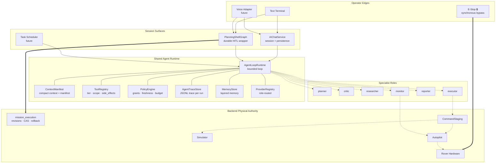
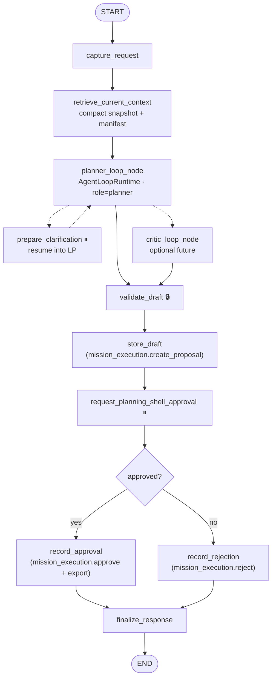
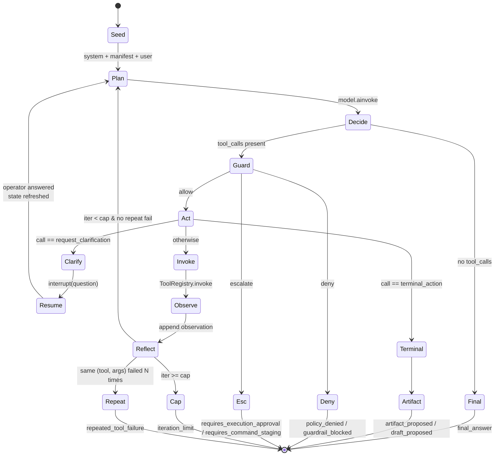
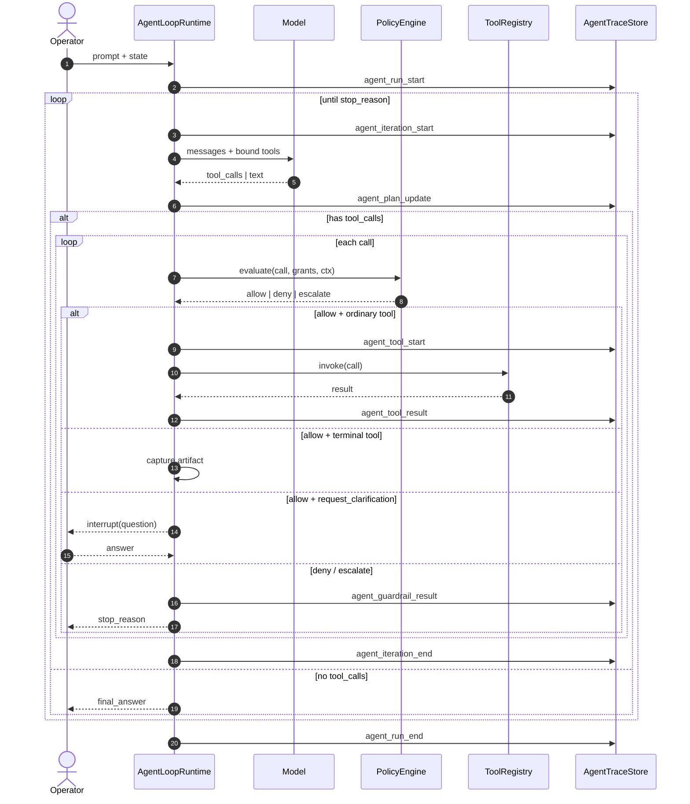
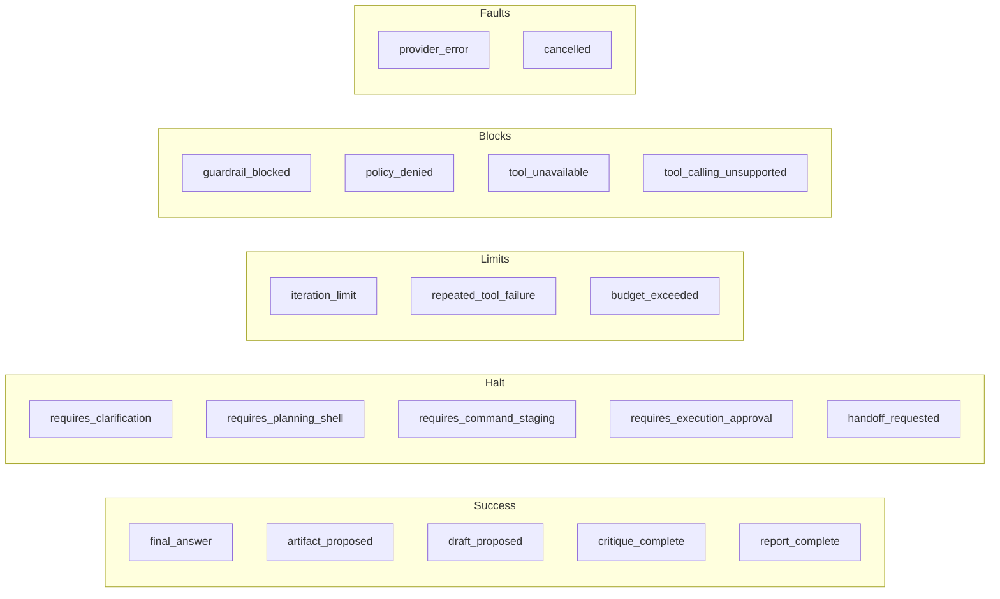
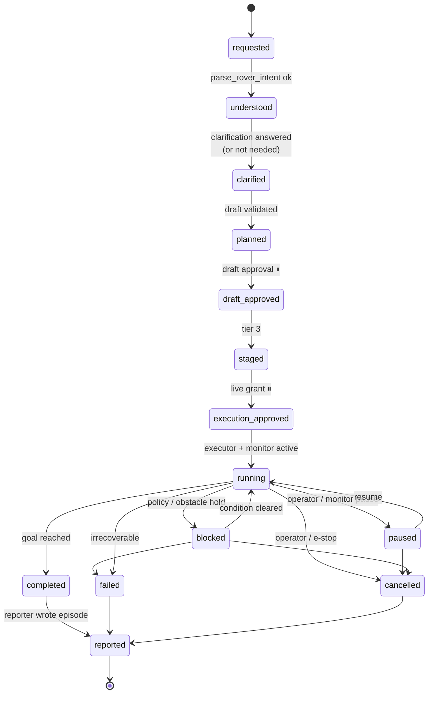
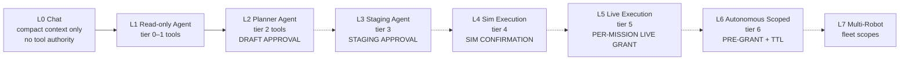

# AI Agent — Graph and State Machine Specification

This document is the visual companion to:

- [`../requirements.md`](../requirements.md)
- [`../design.md`](../design.md)

If anything here contradicts the requirements doc, the requirements doc wins.

## Reading Guide

The diagrams in this document answer four durable questions:

1. what the agent system looks like overall
2. what the current planning shell looks like
3. what one agent run does internally
4. how authority expands in later phases

## 1. Top-Level System Map



Three load-bearing boundaries:

- reasoning lives in `AgentLoopRuntime`
- capability enforcement lives in `ToolRegistry` plus `PolicyEngine`
- physical authority lives in backend services, autopilot, and hardware rather
  than in the model loop

## 2. Current Planning Shell

The planner loop is the sole planning core. Deterministic validation and
approval remain outside free-form model reasoning.



Durable properties:

- `validate_draft` is the last deterministic gate before storage
- draft approval is the only operator approval at this planning tier
- canonical mission storage lives in `mission_execution`
- clarification resumes the same planning loop rather than switching to a
  separate planning path

## 3. AgentLoopRuntime — Internal State Machine

Every chat run, planner run, specialist run, and future voice/task/monitor
invocation passes through this machine.



Invariants:

- exactly one stop reason per run
- every tool call passes through a policy/guard step first
- terminal artifacts are schema-defined tools, not prompt-parsed blobs
- clarification is durable resume, not a fresh run
- execution-capable tools are not bound in the ordinary loop by default

### 3.1 Per-Iteration Sequence



## 4. Stop Reasons

Every run exits with exactly one stop reason.



The runtime contract is that a run chooses one terminal reason, traces it, and
 projects that reason to the caller.

## 5. Task Lifecycle

Future long-horizon task handling should follow this lifecycle:



Hard invariants:

- `running` is only reachable after both draft approval and execution approval
- stopping transitions stay cheap
- every terminal state reaches reporting

## 6. Capability Ladder



Authority only increases when a new tool tier, policy surface, and approval
surface are added together.

## 7. Future Live Execution With Monitor

The platform is intended to support live execution without letting the model
directly publish commands.

```mermaid
flowchart TB
    OP([operator: run approved inspection])
    G{grant valid?<br/>TTL · scope}
    EXE[executor specialist · tier 5]
    MX[mission_execution<br/>revision · CAS]
    STG[command staging]
    SIM{simulator available?}
    SR[run in simulator]
    DF{operator accepts diff?}
    APH[autopilot handoff]
    HW[rover hardware]

    MON[monitor specialist]
    TEL[(telemetry)]
    PER[(perception)]
    LOCK[(controller lock)]
    BAT[(battery)]

    POL{policy:<br/>geofence · freshness · lock · battery · obstacle}
    PAUSE[executor.pause]
    REPL[planner.replan]
    ESTOP[E-Stop 🔒<br/>synchronous bypass]
    REP[reporter]

    OP --> G
    G -- no --> X1([refuse: requires_execution_approval])
    G -- yes --> EXE --> MX --> STG --> SIM
    SIM -- yes --> SR --> DF
    DF -- no --> X2([rejected at sim diff])
    DF -- yes --> APH
    SIM -- no --> APH
    APH --> HW

    HW --> TEL
    HW --> PER
    HW --> LOCK
    HW --> BAT
    TEL & PER & LOCK & BAT --> MON
    MON --> POL

    POL -- breach .-> ESTOP
    POL -- stale .-> PAUSE
    POL -- replan .-> REPL
    POL -- ok --> HW

    HW -. completed .-> REP
    HW -. failed .-> REP
    PAUSE -. cancelled .-> REP
    ESTOP ===> HW
```

Properties:

- the agent requests through `mission_execution` and staging; it does not
  directly publish commands
- the monitor escalates rather than directly acting
- e-stop remains a synchronous bypass
- all terminal outcomes still reach reporting

## 8. Out Of Scope

Out of scope for this graph document:

- exact runtime dataclass shapes
- exact tool schemas and side-effect declarations
- memory-layer schemas
- event JSON payload shapes
- detailed staging schema and hardware-latency execution specs
