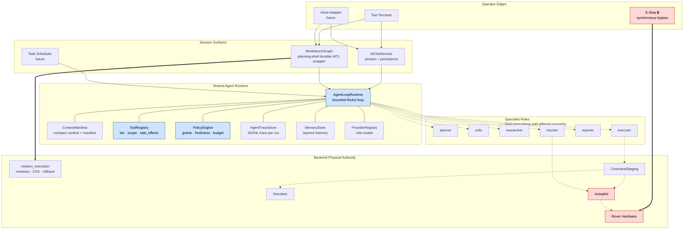
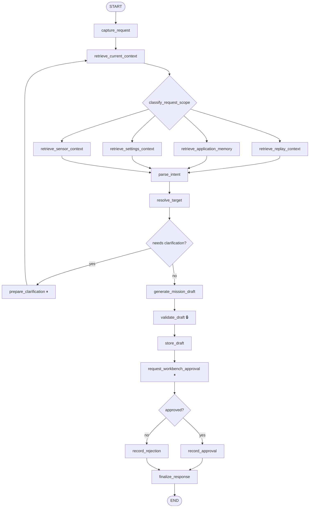
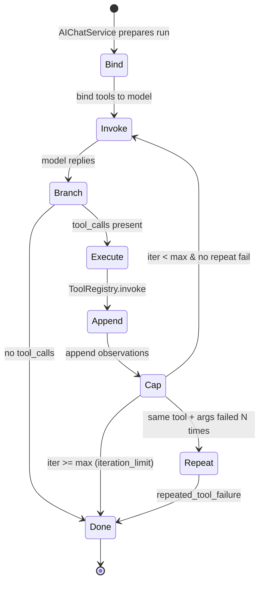
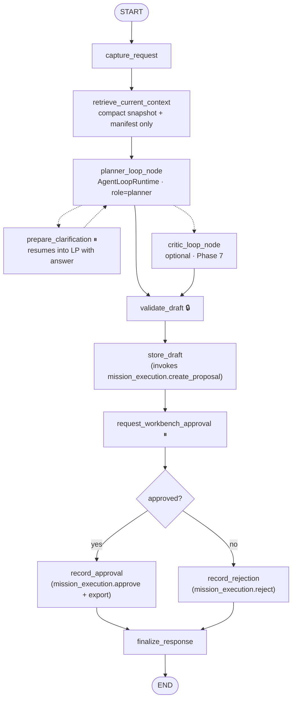
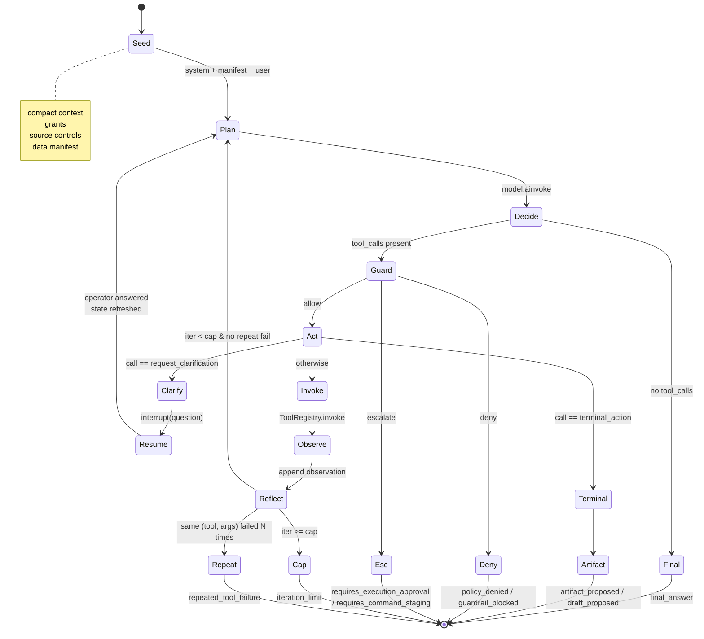
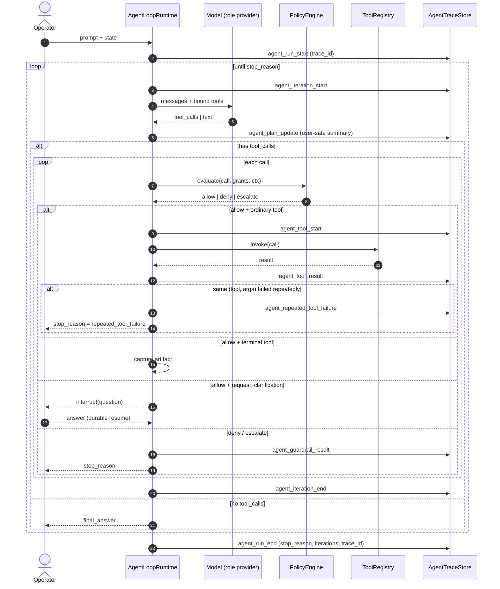
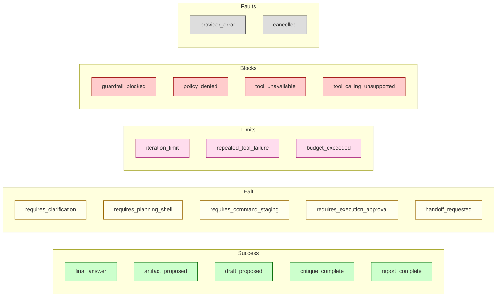
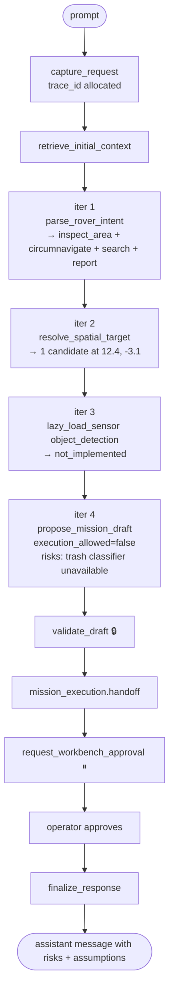
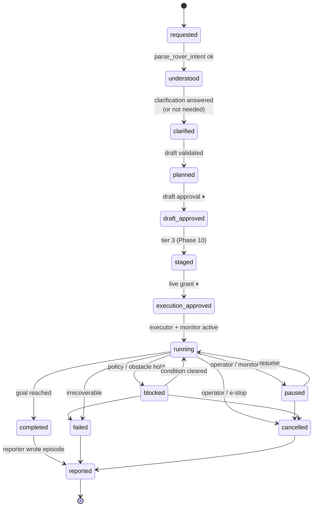

# AI Agent — Graph and State Machine Specification (Final)

Status date: 2026-05-18.
Status: canonical. Synthesized on 2026-05-18 from three source drafts
(prior canonical, codex regen, claude rewrite) which are preserved in
[`docs/archive/ai-agent/2026-05-18-graph-spec-merge/`](../../../archive/ai-agent/2026-05-18-graph-spec-merge/)
for historical reference.

This document is the visual companion to:

- [`../requirements.md`](../requirements.md) — product requirements,
  fixed decisions, capability ladder.
- [`../design.md`](../design.md) — runtime interfaces, phase plan,
  implementation details.

If anything here contradicts the requirements doc, the requirements
doc wins. If anything here contradicts the design doc, raise it in
review — they should agree.

## Implementation Status (2026-05-18)

Phases 1–6 are complete. The planner-loop is the sole mission-planning
core; the deterministic-DAG middle has been removed.

- `AgentLoopRuntime` powers Agent chat (Phase 1 done).
- `AgentTraceStore` writes JSONL traces; stop reasons are persisted
  (Phase 2 done).
- `PolicyEngine` seam + extended `ToolDefinition` (tier · scopes ·
  side_effects) is in (Phase 3 done).
- Bounded lazy tools shipped (Phase 4 done).
- Planner-loop node ships behind `ai_use_planner_loop` (Phase 5 done).
- Deterministic-DAG middle removed; `ai_use_planner_loop` defaults to
  `True`; `prepare_clarification` routes back to `planner_loop_node`
  on resume with the operator's answer injected into the planner
  context (Phase 6 done).
- `mission_execution` revisioning is invoked from inside `store_draft`
  (proposal create, approval, rejection, export). A separate
  `handoff_to_mission_execution` graph node is **not** present; the
  handoff is a call inside the storage node. Diagrams that show it as
  a distinct node are simplified for readability — see the §3 note.

The next architecture work is RAG / web-grounded sources, real
flight-controller handoff, and execution-safety design (Phases 7+).

## Reading Guide

Diagrams use Mermaid (renders in GitHub, VS Code, most viewers). Where
a diagram is dense, an ASCII or table form follows.

Symbols:

| Symbol | Meaning |
|---|---|
| ▢ rectangle | node / function / runtime component |
| ◇ diamond | decision |
| ◯ pill | persistent state |
| ━━► solid | always-taken transition |
| ┄┄► dashed | conditional / optional transition |
| 🔒 lock | code-enforced safety boundary |
| ⏸ pause | LangGraph `interrupt()` — durable HITL wait |

The doc answers four questions in order:

1. What does the system look like overall? (§1)
2. What was the pre-Phase-6 planning shell (historical)? (§2)
3. What is the planning shell today (post Phase 6)? (§3)
4. What does one loop run look like inside? (§4)

Skim §1 → §4 → §9 for the three diagrams that carry the most weight.

## 1. Top-Level System Map



Three load-bearing boundaries:

- **Reasoning lives in `AgentLoopRuntime`.** Tool choice, summaries,
  draft proposals, clarification.
- **Capability enforcement lives in `ToolRegistry` + `PolicyEngine`.**
  Permissions, grants, source controls — all in code, never in the
  prompt.
- **Physical authority lives in the backend.** `mission_execution`
  owns canonical mission state; autopilot/hardware own actuation;
  e-stop is a synchronous code path that bypasses everything else.

Specialists are not separate processes. Each is an `AgentLoopRuntime`
invocation with a different system prompt, tool subset, and exit
condition.

## 2. Historical: Pre-Phase-6 Planning Shell

### 2.1 Planning Shell — Hand-Wired DAG (removed in Phase 6)

Before Phase 6, `gcs_server/ai/workbench_graph.py` was a deterministic
graph where each node ran at most once per request. It is preserved
here to explain the motivation for the planner-loop migration; the
current shape is in §3.



Pain points that motivated the migration (all addressed in §3):

- Adding any new data surface required a node + a router edge + state
  plumbing; the four `retrieve_*` nodes were near-duplicates.
- The planner could not interleave reasoning with retrieval. "Zero
  candidates from `resolve_target`" could not lead to "widen the
  radius and retry"; the only fallback was the clarification
  interrupt.
- Each model call was single-shot. Quality was capped by
  single-prompt engineering.

### 2.2 Agent Chat Loop — Already the Target Shape

`gcs_server/ai/agent_loop.py` now owns the bounded tool loop that
previously lived inside `chat_service.py`.



Same shape as the future planner loop. The remaining work is to reuse
this runtime in the planning shell (Phase 5–6) and to add the missing
seams: typed terminal artifacts, policy decisions, full stop-reason
enum, specialist roles.

## 3. Current Planning Shell (Post Phase 6)

The deterministic-DAG middle has been removed. The planner loop is the
default and sole mission-planning core.



Implementation note: `mission_execution` is invoked as a service call
*inside* `store_draft`, `record_approval`, and `record_rejection`
(`workbench_graph.py:554-593, 973-1003, 1055-1063`), not as a separate
graph node. The diagram above is faithful to the runtime flow but
collapses the handoff into the storage / approval / rejection nodes
where the call sites live.

What collapsed into tools (Phase 6 removals):

| Removed deterministic node | Replaced by |
|---|---|
| `classify_request_scope` | implicit in planner's first tool choice |
| `retrieve_replay_context` | `lazy_load_replay` tool |
| `retrieve_application_memory` | `lazy_load_ai_memory` tool |
| `retrieve_settings_context` | `lazy_load_settings` tool |
| `retrieve_sensor_context` | `lazy_load_sensor` tool |
| `parse_intent` | `parse_rover_intent` tool |
| `resolve_target` | `resolve_spatial_target` tool |
| `generate_mission_draft` | `propose_mission_draft` terminal tool |
| `prepare_clarification` | `request_clarification` tool wrapping `interrupt()` |

Net change in `workbench_graph.py`: ~530 lines removed.

Properties preserved through the migration:

- **`validate_draft` stays deterministic** and is the last gate before
  storage. The critic can *warn* the operator; only `validate_draft`
  can *block*.
- **Approval surfaces do not multiply.** Draft approval remains the
  only operator approval at this tier.
- **Canonical mission storage lives in `mission_execution`.** The
  shell calls into it from `store_draft` / `record_approval` /
  `record_rejection`; `mission_execution` owns canonical revisions,
  CAS checks against controller version, and rollback.

## 4. AgentLoopRuntime — Internal State Machine

The single most important diagram in the spec. Every chat run, every
planner run, every specialist run, every future voice / task / monitor
invocation passes through this machine.



Invariants the diagram enforces:

- **Exactly one stop reason per run.** Every terminal arrow names the
  reason emitted.
- **Guard precedes every tool call.** Policy is enforced in code, not
  in the prompt.
- **Terminal artifacts are tools.** `propose_mission_draft` is a
  schema'd tool, not a parsed JSON blob. The schema is the contract;
  the validator is independent.
- **Clarification is durable.** The same `run_id` / `trace_id`
  resumes after the operator answers.
- **Execution tools are not bound here.** `_bind_role_tools` filters
  by `permissions ⊆ DEFAULT_PERMISSIONS`; tier ≥ 3 tools cannot reach
  the model in this loop.

### 4.1 Per-Iteration Sequence



## 5. Stop Reasons — The Exit Surface

Every run exits with exactly one stop reason. The full enum is in
`functional-spec §Stop Reasons`; here is the colour-grouped mental
model.



Currently wired (2026-05-18): `final_answer`, `draft_proposed`,
`iteration_limit`, `tool_calling_unsupported`, `requires_clarification`,
`provider_error`, `cancelled`, `repeated_tool_failure`, `policy_denied`.
The rest are reserved enum values with stub handlers; they activate as
their phases ship.

## 6. Worked Example — "Around the Charging Station"

Operator prompt: *"Please go around the charging station, look for any
trash, and report what you find."*



What this trace proves:

- **Capability gaps surface honestly.** The planner discovered
  "trash classifier unavailable" via `lazy_load_sensor` and encoded it
  in the draft as a risk + assumption.
- **`execution_allowed = false` is enforced twice.** Once in the tool
  schema (`propose_mission_draft` rejects `true` in this run mode),
  once in `validate_draft`. Two independent enforcement points.
- **Legacy UI events still fire.** `mission_draft_created`,
  `mission_draft_validation`, `mission_draft_approval_required`,
  `graph_interrupt`, `mission_draft_decision` are all preserved.
- **New loop events are additive.** `agent_iteration_start`,
  `agent_tool_start`, `agent_tool_result`, `agent_plan_update`,
  `agent_run_end` are emitted for audit / replay / eval — they
  augment, they do not replace.

Trace file: `data/agent_traces/2026-05-18/{trace_id}.jsonl`, roughly
20 events end-to-end.

## 7. Task Lifecycle (Phase 9+)

Today every plan is one-shot. After `TaskStore` ships, plans become
first-class long-lived entities.



Hard invariants visible in this diagram:

- `running` is only reachable through both `draft_approved` *and*
  `execution_approved`. Two approvals, two states, no shortcut.
- Failure-safe transitions (`paused`, `blocked`, `cancelled`) need no
  additional approval. Stopping is always cheap.
- `reported` is reachable from every terminal state. Failure
  post-mortems are first-class.
- The planner cannot write task state. It calls
  `propose_task_transition(task_id, target)`; the task service decides.

## 8. Capability Ladder

```mermaid
flowchart LR
    L0[L0 Chat<br/>compact context only<br/>no tool authority]
    L1[L1 Read-only Agent<br/>tier 0–1 tools<br/>no approval]
    L2[L2 Planner Agent<br/>tier 2 tools<br/>WORKBENCH APPROVAL]
    L3[L3 Staging Agent<br/>tier 3<br/>STAGING APPROVAL]
    L4[L4 Sim Execution<br/>tier 4<br/>SIM CONFIRMATION]
    L5[L5 Live Execution<br/>tier 5<br/>PER-MISSION LIVE GRANT]
    L6[L6 Autonomous Scoped<br/>tier 6<br/>PRE-GRANT + TTL]
    L7[L7 Multi-Robot<br/>fleet scopes]

    L0 --> L1 --> L2
    L2 -. Phase 10 ADR + safety review .-> L3
    L3 -. Phase 11 .-> L4
    L4 -. Phase 12 full safety audit .-> L5
    L5 -. Phase 14 .-> L6
    L6 -. Phase 15 .-> L7

    classDef now fill:#cfc,stroke:#060,color:#000
    classDef soon fill:#ffe,stroke:#960,color:#000
    classDef gated fill:#fcc,stroke:#900,color:#000
    class L0,L1,L2 now
    class L3,L4 soon
    class L5,L6,L7 gated
```



Green is today. Yellow is near-term and ADR-gated. Red requires a
full safety audit before unlock.

**No tier above L2 is reachable without an explicit ADR and a separate
approval surface.** Authority only increases when a new tier, policy
surface, and approval surface are added together.

## 9. Phase 12 Live Execution with Monitor (Future Sketch)

The hardest future flow, drawn here so reviewers can judge whether the
platform supports it without restructuring.

```mermaid
flowchart TB
    OP([operator: run approved inspection])
    G{grant valid?<br/>TTL · scope}
    EXE[executor specialist · tier 5]
    MX[mission_execution<br/>revision · CAS]
    STG[command staging]
    SIM{simulator available?}
    SR[run in simulator]
    DF{operator accepts diff?}
    APH[autopilot handoff]
    HW[rover hardware]

    MON[monitor specialist<br/>one per mission]
    TEL[(telemetry)]
    PER[(perception)]
    LOCK[(controller lock)]
    BAT[(battery)]

    POL{policy:<br/>geofence · freshness · lock · battery · obstacle}
    PAUSE[executor.pause]
    REPL[planner.replan]
    ESTOP[E-Stop 🔒<br/>synchronous bypass]
    REP[reporter · episode record]

    OP --> G
    G -- no --> X1([refuse: requires_execution_approval])
    G -- yes --> EXE --> MX --> STG --> SIM
    SIM -- yes --> SR --> DF
    DF -- no --> X2([rejected at sim diff])
    DF -- yes --> APH
    SIM -- no --> APH
    APH --> HW

    HW --> TEL
    HW --> PER
    HW --> LOCK
    HW --> BAT
    TEL & PER & LOCK & BAT --> MON
    MON --> POL

    POL -- breach .-> ESTOP
    POL -- stale .-> PAUSE
    POL -- replan .-> REPL
    POL -- ok --> HW

    HW -. completed .-> REP
    HW -. failed .-> REP
    PAUSE -. cancelled .-> REP
    ESTOP ===> HW

    classDef hot fill:#fcc,stroke:#900,color:#000
    class ESTOP,POL,APH,HW hot
```

Properties this confirms:

- **The agent never publishes commands.** Even at L5, the executor
  *requests* via `mission_execution` and command staging; the
  autopilot *enforces*.
- **The monitor escalates but does not act.** It produces
  `monitor_event` artifacts; pause / replan / e-stop are signals to
  other services.
- **E-stop is a synchronous bypass.** It does not traverse the loop,
  the monitor, staging, or `mission_execution`.
- **Every terminal state reaches `reporter`.** Failure post-mortems
  are first-class.

## 10. Phase-by-Phase Transition Map

| Phase | Runtime / Shell delta | New nodes / surfaces | Safety added |
|---|---|---|---|
| 0 (today) | DAG planning shell + extracted chat loop | — | tool tier filter |
| **1** ✓ | `AgentLoopRuntime` powers Agent chat | — | parity |
| **2** ✓ | `AgentTraceStore` (JSONL); stop reasons; repeated-tool-failure | trace inspection endpoints | trace IDs persisted per run |
| **3** ✓ | `PolicyEngine` seam; extended `ToolDefinition` (tier · scopes · side_effects); data manifest | — | tier ladder declared; manifest in context |
| **4** ✓ | bounded lazy tools (settings · sessions · sensor stubs) | — | tools read-only & redacted |
| **5** ✓ | planner-loop node behind `ai_use_planner_loop` flag | `planner_loop_node` | unchanged surface |
| **6** ✓ | deterministic-DAG middle removed; planner-loop default-on; `mission_execution` invoked from `store_draft` / approval / rejection | 8 nodes deleted; clarification routes back into planner loop | `propose_mission_draft` schema forces `execution_allowed=false` |
| 7 | critic + reporter specialists; memory layers populated | optional `critic_loop_node` | memory writes redacted & retention enforced |
| 8 | voice adapter | — (loop unchanged) | fixed-grammar approvals; voice e-stop bypass |
| 9 | `TaskStore`, scheduler tick | scheduler entry point | task lifecycle invariants |
| 10 | command staging service; executor specialist | staging approval ⏸ | **separate staging approval surface** |
| 11 | simulator integration | — | sim-first; projected vs simulated diff |
| 12 | monitor specialist; autopilot handoff | per-mission monitor graph | freshness / geofence / lock / battery policies; e-stop primacy |
| 13 | onboard provider registry | — | onboard refuses tier ≥ 3 by default |
| 14 | tier-6 grant infrastructure | — | pre-grant TTL + auto-revoke on policy violation |
| 15 | multi-robot scope handling | — | per-fleet policy & grants |

✓ = completed as of 2026-05-18.

**After Phase 3 the runtime contract should stop changing.** Phases 4+
add tools, policies, specialists, or shells. A loop change after
Phase 3 is a platform change and reviewed as such.

## 11. Reading the Diagrams: Quick Index

| Question | Section |
|---|---|
| Where does the agent fit in the overall system? | §1 Top-Level Map |
| What was wrong with the pre-Phase-6 planning shell? | §2.1 Historical DAG |
| Where is the loop today? | §2.2 Chat Loop |
| What does the current planning shell look like? | §3 Current Planning Shell |
| What does the agent actually do inside one run? | §4 Internal State Machine |
| What happens iteration by iteration? | §4.1 Sequence Diagram |
| How does a run end? | §5 Stop Reasons |
| Does the design handle the driving prompt? | §6 Worked Example |
| What does a long-horizon task look like? | §7 Task Lifecycle |
| How does the agent gain authority over time? | §8 Capability Ladder |
| Can the design support live execution safely? | §9 Phase 12 Live Execution |
| What lands by phase? | §10 Phase Transition Map |

## 12. Out of Scope

Out of scope for this graph document (live in the functional spec):

- runtime dataclass shapes (`AgentLoopConfig`, `AgentLoopStep`,
  `AgentLoopResult`) → functional spec §AgentLoopRuntime
- exact tool definitions and side-effect declarations → functional
  spec §Tool and Permission Model
- memory layer schemas → functional spec §Memory Subsystem
- event JSON shapes → functional spec §Event Model

Out of scope for *all three* documents (will live in a separate Safety
and Execution Specification when Phase 10 begins):

- staging schema details
- e-stop hardware latency budgets
- geofence math and tolerance
- sim-vs-live diff UI design
- per-fleet coordination protocol

## 13. Provenance

This document is a synthesis of three drafts produced on 2026-05-18:

- `ai-agent-graph-spec.md` (canonical, narrative depth)
- `ai-agent-graph-spec-codex-2026-05-18.md` (terse, surfaced
  `mission_execution` in the top-level map)
- `ai-agent-graph-spec-claude-2026-05-18.md` (added stop-reason
  taxonomy, capability colouring, comparison cheat sheet)

The three source drafts are archived in
`docs/archive/ai-agent/2026-05-18-graph-spec-merge/`. This file is the
canonical graph spec.

Revision log:

- 2026-05-18 (initial): merged from three drafts; Phase 6 pending.
- 2026-05-18 (final): updated to reflect Phase 6 completion — DAG
  middle removed, planner loop default, clarification routes back
  into planner loop, `mission_execution` invoked from storage /
  approval / rejection nodes.
